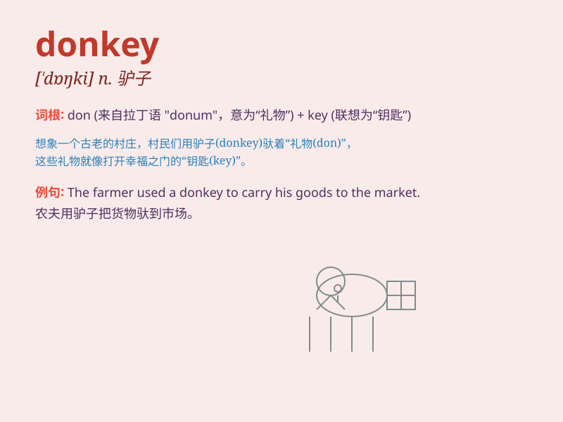

## donkey

**英音:** _[\'dɒŋkɪ]_ **美音:** _[ˈdɑŋkɪ]_

**译义:** *n.驴子,笨蛋,顽固者,(=donkey engine)轻便发动机,(=donkey
pump)辅助泵*

### 短语

+ **donkey work:** _艰苦单调而又无趣的工作_

+ **talk the hind legs off a donkey:** _唠叨个没完没了_

+ **donkey\'s years:** _很长时间；多年_

+ **a stubborn donkey:** _一头倔强的驴_

+ **ride a donkey:** _骑驴_

### 例句

#### 例句1

> **The donkey carried heavy loads up the hill.**

**中文翻译:** 驴子驮着重物上山。

**单词释义:** 驴子

#### 例句2

> **He\'s as stubborn as a donkey.**

**中文翻译:** 他像头驴子一样固执。

**单词释义:** 驴子（比喻人的性格固执）

#### 例句3

> **The children had a ride on the donkey at the fair.**

**中文翻译:** 孩子们在集市上骑了毛驴。

**单词释义:** 驴子

### 背诵小故事

> One day, a little boy was lost in the forest. A friendly donkey
appeared and carried the boy on its back to find the way home. The
donkey was so brave and kind. Remember, donkey means a domestic animal
related to the horse but smaller.

**一天，一个小男孩在森林里迷路了。一只友好的驴子出现了，驮着男孩找回家的路。驴子非常勇敢和善良。记住，donkey
意思是一种与马有关但较小的家畜。**

### 图义

