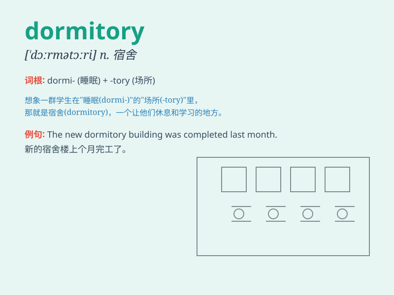

## dormitory

**英音:** _[ˈdɔːmɪt(ə)ri]_ **美音:** _[\'dɔrmətɔri]_

**译义:** *n.宿舍*

### 短语

+ **dormitory building:** _宿舍楼_

+ **dormitory room:** _宿舍房间_

+ **dormitory life:** _宿舍生活_

+ **university dormitory:** _大学宿舍_

+ **student dormitory:** _学生宿舍_

### 例句

#### 例句1

> **I live in a dormitory on campus.**

**中文翻译:** 我住在校园的宿舍里。

**单词释义:** 宿舍

#### 例句2

> **The dormitory was very noisy at night.**

**中文翻译:** 晚上宿舍很吵。

**单词释义:** 宿舍

#### 例句3

> **She decorated her dormitory with posters and photos.**

**中文翻译:** 她用海报和照片装饰了宿舍。

**单词释义:** 宿舍

### 背诵小故事

> A group of students were very tired after a long day of study. They
went back to their dormitory to rest. The dormitory was like a warm home
for them, with beds and desks. It was a place for them to sleep and
study.

**一群学生在漫长的一天学习后非常疲惫。他们回到宿舍休息。宿舍对他们来说就像一个温暖的家，有床和书桌。这是他们睡觉和学习的地方。**

### 图义

