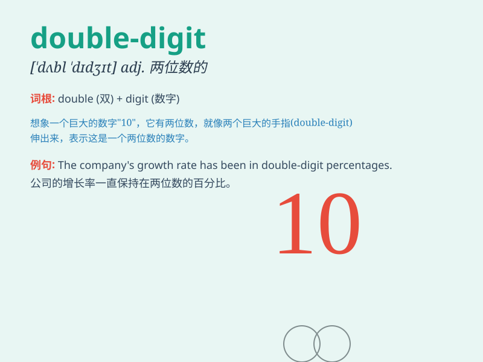

## double-digit

**英音:** _[ˈdʌbəl ˈdɪdʒɪt]_ **美音:** _[ˈdʌbəl
ˈdɪdʒɪt]_

**译义:**
*由两个数字组成的，两位数的（通常用于经济或统计学中描述增长或变化的幅度达到十个百分点以上的情况）*

### 短语

+ **double-digit growth:** _两位数的增长_

+ **double-digit inflation:** _两位数的通货膨胀_

+ **double-digit unemployment:** _两位数的失业率_

+ **double-digit increase:** _两位数的增加_

+ **double-digit decline:** _两位数的下降_

### 例句

#### 例句1

> **The company\'s growth rate has reached double-digit figures this
year.**

**中文翻译:** 这家公司今年的增长率已经达到了两位数。

**单词释义:** 两位数的

#### 例句2

> **The country is facing double-digit unemployment.**

**中文翻译:** 这个国家正面临着两位数的失业率。

**单词释义:** 两位数的

#### 例句3

> **The inflation rate has been in the double-digit range for several
months.**

**中文翻译:** 通货膨胀率已经连续几个月处于两位数的范围。

**单词释义:** 两位数的

### 背诵小故事

>
想象一下，你在一个神秘的数字王国，所有数字都在排队。突然，出现了一群特殊的数字，它们的身体都是由两个相同的数字组成，比如
11、22 等，人们称它们为 double-digit。

**想象你在数字王国看到由两个相同数字组成的数字，比如 11、22
等，人们称其为两位数。**

### 图义

