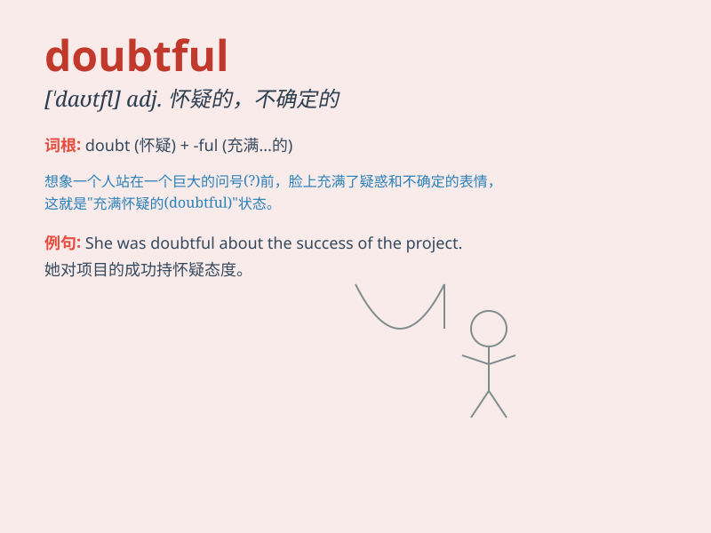

## doubtful

**英音:** _[\'daʊtfʊl; -f(ə)l]_ **美音:** _[\'daʊtfəl]_

**译义:** *adj.可疑的,不确的,疑心的*

### 短语

+ **be doubtful about:** _对\...\...感到怀疑_

+ **doubtful case:** _可疑的案例_

+ **doubtful point:** _疑点_

+ **look doubtful:** _看起来可疑_

+ **seem doubtful:** _似乎可疑_

### 例句

#### 例句1

> **I\'m doubtful about his ability to complete the task on time.**

**中文翻译:** 我对他能否按时完成任务表示怀疑。

**单词释义:** 怀疑的；不确定的

#### 例句2

> **The future of the company is doubtful after the recent financial
losses.**

**中文翻译:** 在最近的财务损失之后，该公司的未来令人怀疑。

**单词释义:** 不确定的；难以预测的

#### 例句3

> **It\'s doubtful whether she\'ll come to the party.**

**中文翻译:** 她是否会参加聚会还值得怀疑。

**单词释义:** 不大可能的；可疑的

### 背诵小故事

> A detective was investigating a crime. The clues were confusing and
he felt doubtful about the suspect\'s alibi. But with more evidence, he
finally solved the mystery and removed his doubts.

**一位侦探在调查一起犯罪案件。线索令人困惑，他对嫌疑人的不在场证明感到怀疑。但随着更多证据的出现，他最终解开了谜团，消除了疑虑。**

### 图义

