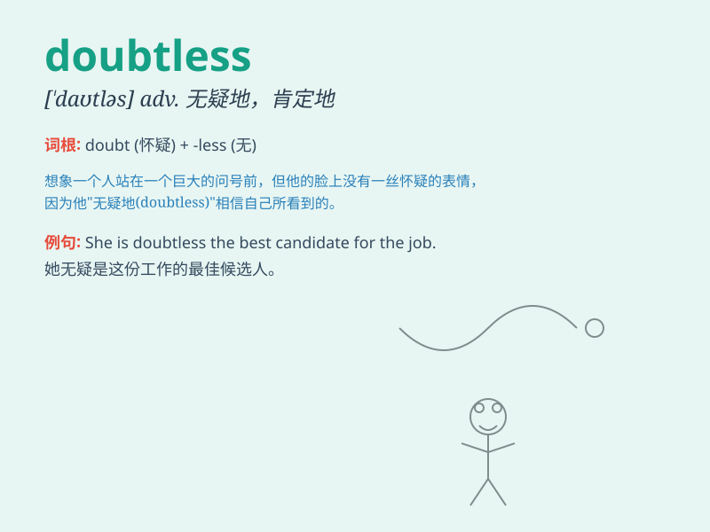

## doubtless

**英音:** _[\'daʊtlɪs]_ **美音:** _[\'daʊtləs]_

**译义:** *adj.无疑的,确定的adv.无疑地,确定地,\<口>大概、多半*

### 短语

+ **doubtless of:** _对\...\...无疑_

+ **doubtless that:** _无疑\...\..._

+ **be doubtless:** _是无疑的_

+ **doubtless to do sth:** _无疑会做某事_

+ **doubtless in:** _在\...\...方面无疑_

### 例句

#### 例句1

> **Doubtless, she will succeed in her new job.**

**中文翻译:** 毫无疑问，她会在新工作中取得成功。

**单词释义:** 毫无疑问；肯定地

#### 例句2

> **He is doubtless the best candidate for the position.**

**中文翻译:** 他无疑是该职位的最佳人选。

**单词释义:** 无疑；必定

#### 例句3

> **Doubtless, the weather will improve soon.**

**中文翻译:** 毫无疑问，天气很快就会好转。

**单词释义:** 肯定；无疑

### 背诵小故事

> A brave knight was on a quest. Everyone said he would succeed.
Doubtless! Because he was always victorious in battles. His skills were
beyond question. So, doubtless means without doubt or certainly.

**一位勇敢的骑士踏上了征途。大家都说他会成功。毫无疑问！因为他在战斗中总是胜利。他的技能无可置疑。所以，doubtless
意思是毫无疑问，肯定。**

### 图义

