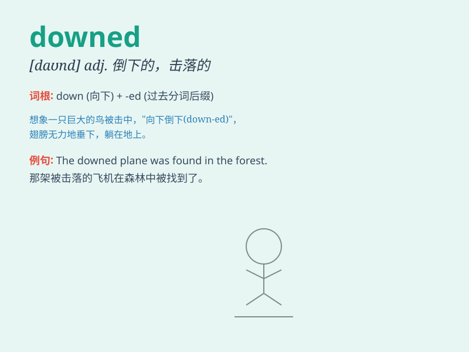

## downed

**英音:** _[daʊnd]_ **美音:** _[daʊnd]_

**译义:** *adj. 被击落的；被击败的；被推翻的 v.
击落；击败；推翻（down 的过去式和过去分词）*

### 短语

+ **downed tree:** _被砍倒的树_

+ **downed power line:** _被击倒的电线_

+ **downed aircraft:** _被击落的飞机_

+ **downed enemy:** _被打倒的敌人_

+ **downed animal:** _被击倒的动物_

### 例句

#### 例句1

> **The pilot downed three enemy planes in the battle.**

**中文翻译:** 这位飞行员在战斗中击落了三架敌机。

**单词释义:** 击落

#### 例句2

> **He downed the last of his coffee and left.**

**中文翻译:** 他喝完最后一口咖啡然后离开了。

**单词释义:** 喝完

#### 例句3

> **The wrestler downed his opponent with a powerful throw.**

**中文翻译:** 这位摔跤手用一个有力的摔技将对手摔倒。

**单词释义:** 摔倒

### 背诵小故事

> A pilot was flying high in the sky. Suddenly, the engine failed and
the plane downed. Luckily, the pilot survived. The word \'downed\' here
means to fall to the ground.

**一名飞行员在高空飞行。突然，引擎故障，飞机坠落了。幸运的是，飞行员幸存下来。单词\'downed\'在这里表示落到地面。**

### 图义

