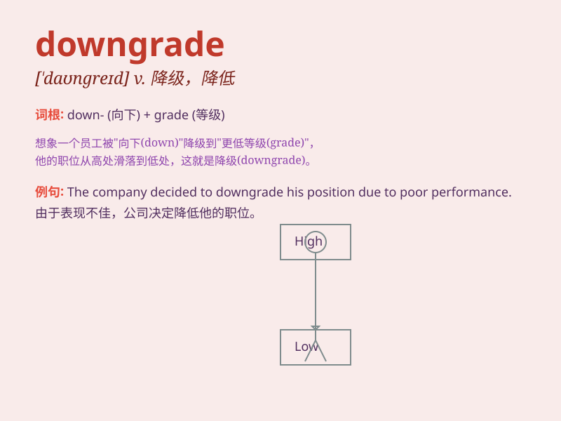

## downgrade

**英音:** _[\'daʊngreɪd; daʊn\'greɪd]_ **美音:**
_[,daʊn\'ɡred]_

**译义:** *n.下坡,退步adj.下坡的,使降级,小看*

### 短语

+ **downgrade risk:** _降级风险_

+ **downgrade assessment:** _降级评估_

+ **downgrade facility:** _降级设施_

+ **downgrade status:** _降级状态_

+ **downgrade version:** _降级版本_

### 例句

#### 例句1

> **The company decided to downgrade the product due to poor
sales.**

**中文翻译:** 由于销售不佳，该公司决定降低该产品的档次。

**单词释义:** 降低\...的等级

#### 例句2

> **His performance at work led to him being downgraded.**

**中文翻译:** 他的工作表现导致他被降级。

**单词释义:** 使降级

#### 例句3

> **The credit rating agency downgraded the country\'s debt.**

**中文翻译:** 信用评级机构下调了该国的债务评级。

**单词释义:** 降低\...的评级

### 背诵小故事

> A brave climber was on the top of the mountain. But due to bad
weather, he had to downgrade his position and move to a lower and safer
place. It was a hard decision but necessary for survival.

**一位勇敢的登山者在山顶。但由于恶劣天气，他不得不降低自己的位置，移动到更低更安全的地方。这是一个艰难但必要的生存决定。**

### 图义

