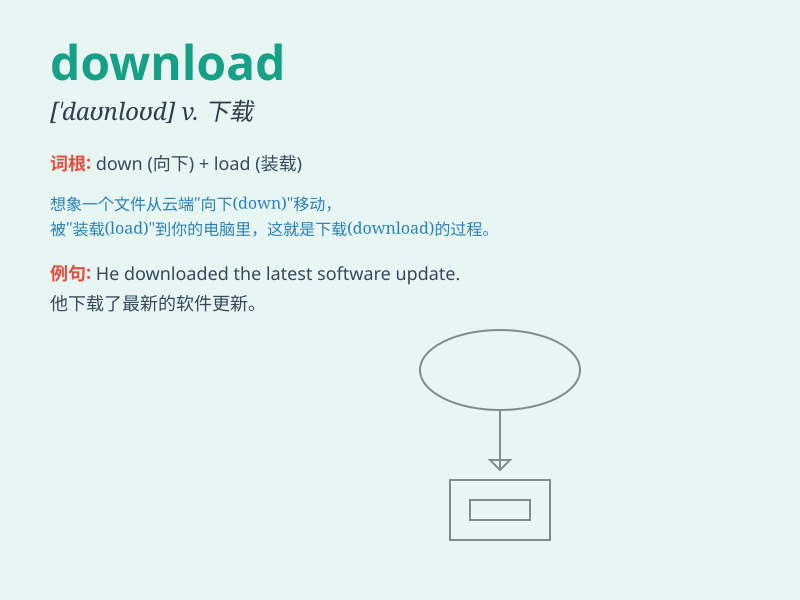

## download

**英音:** _[daʊn\'ləʊd]_ **美音:** _[,daʊn\'lod]_

**译义:** *下载,下传*

### 短语

+ **download file:** _下载文件_

+ **download music:** _下载音乐_

+ **download software:** _下载软件_

+ **download data:** _下载数据_

+ **download video:** _下载视频_

### 例句

#### 例句1

> **I need to download this software for my work.**

**中文翻译:** 我需要为我的工作下载这个软件。

**单词释义:** 下载

#### 例句2

> **You can download the music from the website.**

**中文翻译:** 您可以从网站下载音乐。

**单词释义:** 下载

#### 例句3

> **He spent hours downloading movies last night.**

**中文翻译:** 昨晚他花了几个小时下载电影。

**单词释义:** 下载

### 背诵小故事

> One day, Tom was very excited because he found a wonderful game
online. But he needed to download it to play. So he clicked the
\'download\' button and patiently waited for it to finish. Finally, he
could enjoy the game.

**一天，汤姆非常兴奋，因为他在网上发现了一个很棒的游戏。但他需要下载才能玩。于是他点击了"下载"按钮，耐心等待下载完成。最后，他可以尽情享受游戏了。**

### 图义

