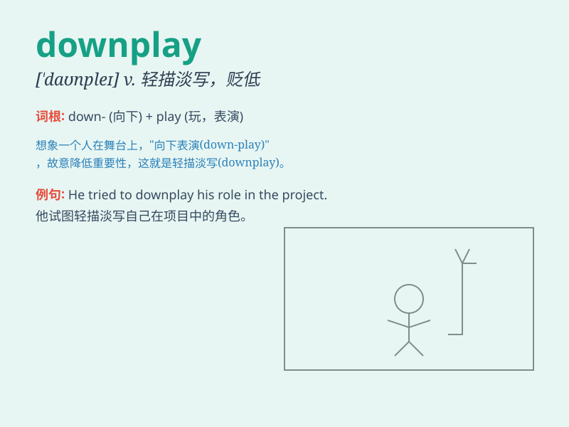

## downplay

**英音:** _[daʊn\'pleɪ]_ **美音:** _[,daʊn\'ple]_

**译义:** *vt.不予重视*

### 短语

+ **downplay the importance:** _淡化重要性_

+ **downplay one\'s achievements:** _贬低某人的成就_

+ **downplay the risk:** _低估风险_

+ **downplay the problem:** _轻视问题_

+ **downplay the role:** _弱化角色_

### 例句

#### 例句1

> **The company tried to downplay the significance of the recent
losses.**

**中文翻译:** 该公司试图淡化近期亏损的严重性。

**单词释义:** 淡化；贬低；对...轻描淡写

#### 例句2

> **He always downplays his achievements when talking to others.**

**中文翻译:** 他在与别人交谈时总是淡化自己的成就。

**单词释义:** 贬低；低估

#### 例句3

> **The media tends to downplay the positive aspects of the
story.**

**中文翻译:** 媒体倾向于淡化故事的积极方面。

**单词释义:** 贬低；轻视

### 背诵小故事

> A boss always downplays the achievements of his employees. But one
day, when a big client praised the team\'s work, the boss couldn\'t deny
it. Then he realized the harm of downplaying others\' efforts.

**一位老板总是贬低员工的成就。但有一天，当一位大客户称赞团队的工作时，老板无法否认。然后他意识到贬低他人努力的危害。**

### 图义

