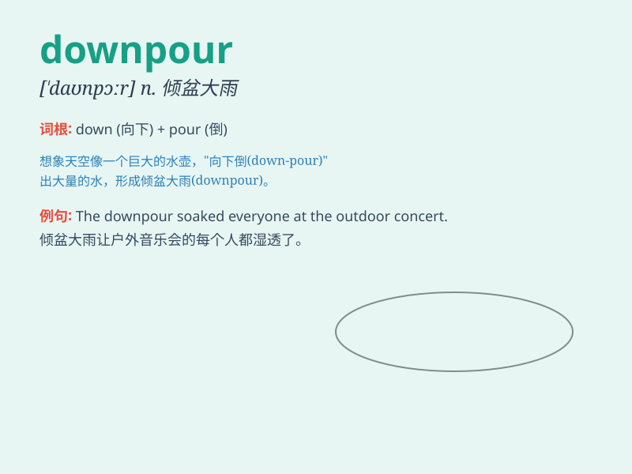

## downpour

**英音:** _[\'daʊnpɔː]_ **美音:** _[\'daʊnpɔr]_

**译义:** *n.倾盆大雨*

### 短语

+ **heavy downpour:** _大暴雨_

+ **sudden downpour:** _突然的倾盆大雨_

+ **torrential downpour:** _暴雨倾盆_

+ **unexpected downpour:** _意想不到的倾盆大雨_

+ **prolonged downpour:** _持续的倾盆大雨_

### 例句

#### 例句1

> **We got caught in a sudden downpour on our way home.**

**中文翻译:** 我们在回家的路上遭遇了一场突如其来的倾盆大雨。

**单词释义:** 倾盆大雨

#### 例句2

> **The downpour lasted for hours, flooding the streets.**

**中文翻译:** 倾盆大雨持续了几个小时，淹没了街道。

**单词释义:** 倾盆大雨

#### 例句3

> **A heavy downpour disrupted the outdoor concert.**

**中文翻译:** 一场倾盆大雨中断了户外音乐会。

**单词释义:** 大暴雨

### 背诵小故事

> One day, I was on a hiking trip. Suddenly, a strong wind blew and
dark clouds gathered. Then came a downpour. I had to find a cave to
hide. It was a crazy experience!

**有一天，我在徒步旅行。突然，一阵强风吹过，乌云聚集。接着下起了倾盆大雨。我不得不找个山洞躲起来。这是一次疯狂的经历！**

### 图义

