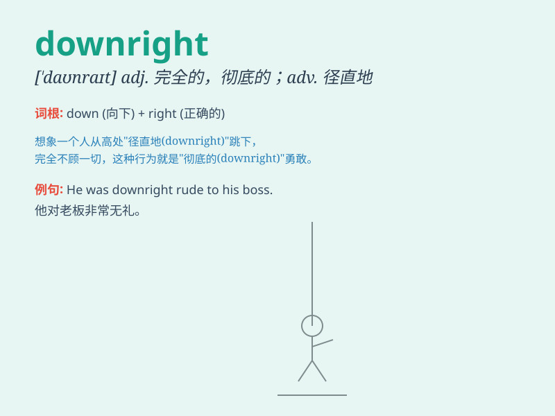

## downright

**英音:** _[\'daʊnraɪt]_ **美音:** _[\'daʊnraɪt]_

**译义:** *adj.明白的,显明的,率直的adv.全然,完全,彻底*

### 短语

+ **downright rude:** _极其粗鲁_

+ **downright false:** _完全错误_

+ **downright impossible:** _绝对不可能_

+ **downright dangerous:** _非常危险_

+ **downright honest:** _十分诚实_

### 例句

#### 例句1

> **The weather was downright awful yesterday.**

**中文翻译:** 昨天的天气实在是太糟糕了。

**单词释义:** 完全地；十足地；彻底地

#### 例句2

> **He is a downright liar.**

**中文翻译:** 他是一个彻头彻尾的骗子。

**单词释义:** 十足的；完全的

#### 例句3

> **This is downright discrimination.**

**中文翻译:** 这是彻头彻尾的歧视。

**单词释义:** 彻头彻尾的；十足的

### 背诵小故事

> A little rabbit was lost in a forest. It was getting dark and cold.
The situation was downright scary. But finally, it found its way home.
The word \'downright\' here means completely or extremely.

**一只小兔子在森林里迷路了。天越来越黑，越来越冷。情况简直可怕极了。但最后，它找到了回家的路。单词\'downright\'在这里表示完全地或极其。**

### 图义

