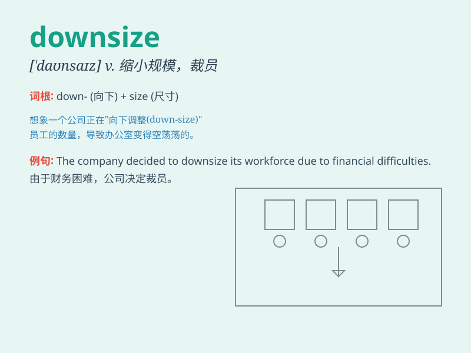

## downsize

**英音:** _[\'daʊnsaɪz]_ **美音:** _[\'daʊnsaɪz]_

**译义:** *vt.以较小尺寸设计(或制造),缩小(汽车等)的外部尺寸*

### 短语

+ **downsize staff:** _裁员_

+ **downsize operations:** _缩小业务规模_

+ **downsize the company:** _缩减公司规模_

+ **downsize production:** _降低产量_

+ **downsize inventory:** _减少库存_

### 例句

#### 例句1

> **The company decided to downsize its workforce by 20% to cut
costs.**

**中文翻译:** 该公司决定裁员 20% 以削减成本。

**单词释义:** 缩减（公司、组织等的）规模

#### 例句2

> **They had to downsize their house when they retired.**

**中文翻译:** 他们退休后不得不缩小房子的面积。

**单词释义:** 缩小（房屋等的）规模

#### 例句3

> **The government is encouraging businesses to downsize and become
more efficient.**

**中文翻译:** 政府正在鼓励企业缩小规模并提高效率。

**单词释义:** 使（企业等）缩小规模

### 背诵小故事

> A big company was facing financial problems. To solve them, they
decided to downsize. They fired many workers and closed some
departments. It was a sad but necessary step to make the company smaller
and more manageable.

**一家大公司面临财务问题。为了解决这些问题，他们决定裁员。他们解雇了许多工人，关闭了一些部门。这是悲伤但必要的一步，以使公司规模变小且更易于管理。**

### 图义

