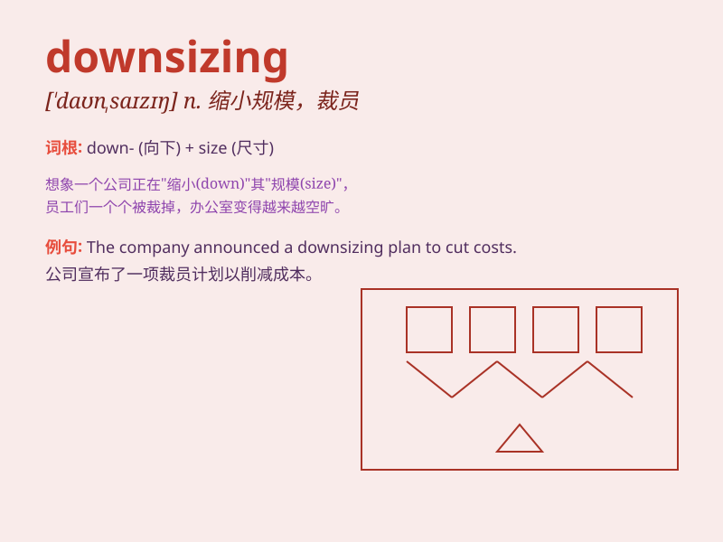

## downsizing

**英音:** _[ˈdaʊnsaɪzɪŋ]_ **美音:** _[ˈdaʊnsaɪzɪŋ]_

**译义:** *减少规模 缩小化*

### 短语

+ **corporate downsizing:** _公司裁员_

+ **economic downsizing:** _经济规模缩小_

+ **downsizing strategy:** _精简策略_

+ **downsizing process:** _精简过程_

+ **workforce downsizing:** _劳动力精简_

### 例句

#### 例句1

> **The company is considering downsizing to cut costs.**

**中文翻译:** 该公司正在考虑缩小规模以削减成本。

**单词释义:** 裁员；精简（规模）

#### 例句2

> **The government\'s downsizing of the bureaucracy has faced some
resistance.**

**中文翻译:** 政府精简官僚机构的举措遇到了一些阻力。

**单词释义:** 精简；缩小（规模）

#### 例句3

> **Downsizing the workforce was a difficult decision for the
management.**

**中文翻译:** 对于管理层来说，裁员是一个艰难的决定。

**单词释义:** 裁减员工；缩小劳动力规模

### 背诵小故事

> A big company was facing financial problems. So, they decided to do
downsizing. They cut many jobs and made the teams smaller. It was a hard
decision but they hoped to save the company.

**一家大公司面临财务问题。所以，他们决定进行裁员。他们裁掉了很多工作岗位，让团队规模变小。这是一个艰难的决定，但他们希望能拯救公司。**

### 图义

