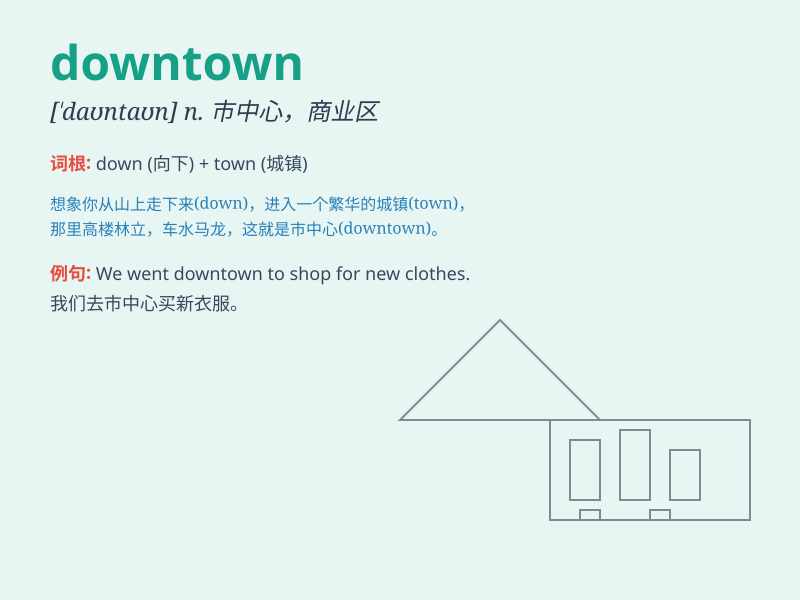

## downtown

**英音:** _[\'daʊntaʊn]_ **美音:** _[\'daʊn\'taʊn]_

**译义:** *adv.在市区,往市区adj.市区的*

### 短语

+ **downtown area:** _市中心区域_

+ **downtown business district:** _市中心商业区_

+ **go downtown:** _去市中心_

+ **downtown traffic:** _市中心交通_

+ **downtown store:** _市中心的商店_

### 例句

#### 例句1

> **I\'m going downtown to do some shopping.**

**中文翻译:** 我要去市中心买点东西。

**单词释义:** 市中心

#### 例句2

> **The office is located downtown.**

**中文翻译:** 办公室位于市中心。

**单词释义:** 市中心

#### 例句3

> **We took a bus downtown to watch the parade.**

**中文翻译:** 我们乘坐巴士前往市中心观看游行。

**单词释义:** 市中心

### 背诵小故事

> A young man named Tom always got lost in the city. One day, his
friend told him to go downtown to find a special store. Tom followed the
main street and finally reached the busy downtown area with many shops
and people.

**一个叫汤姆的年轻人总是在城市里迷路。有一天，他的朋友告诉他去市中心找一家特别的商店。汤姆沿着主街走，终于到达了有很多商店和人的繁忙的市中心区域。**

### 图义

