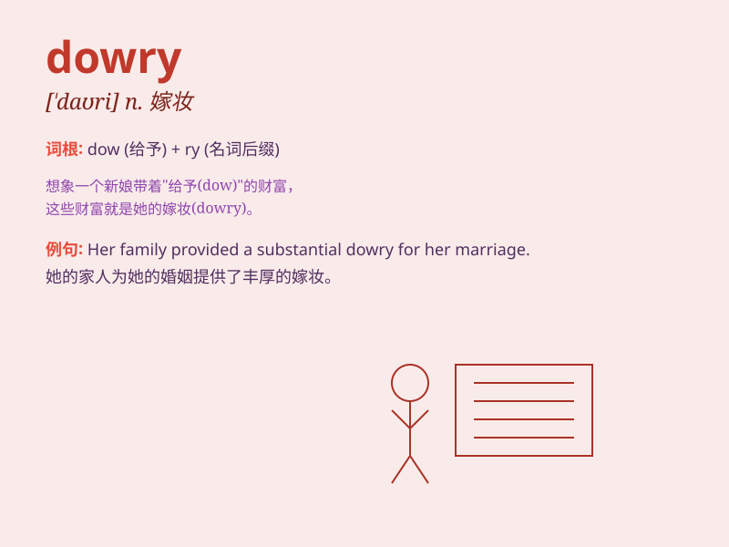

## dowry

**英音:** _[\'daʊ(ə)rɪ]_ **美音:** _[\'daʊri]_

**译义:** *n.嫁妆,天资*

### 短语

+ **dowry payment:** _嫁妆支付_

+ **dowry system:** _嫁妆制度_

+ **demand a dowry:** _索要嫁妆_

+ **provide a dowry:** _提供嫁妆_

+ **refuse a dowry:** _拒绝嫁妆_

### 例句

#### 例句1

> **In some cultures, a large dowry is still expected when a woman
gets married.**

**中文翻译:** 在一些文化中，当一个女人结婚时，仍然期望有一大笔嫁妆。

**单词释义:** 嫁妆

#### 例句2

> **The family was unable to provide a sufficient dowry for their
daughter\'s marriage.**

**中文翻译:** 这个家庭无法为他们女儿的婚姻提供足够的嫁妆。

**单词释义:** 嫁妆

#### 例句3

> **She refused the marriage offer because of the excessive demands
for dowry.**

**中文翻译:** 她拒绝了求婚，因为对嫁妆的要求过高。

**单词释义:** 嫁妆

### 背诵小故事

> A princess was sad as her kingdom could offer only a small dowry for
her marriage. But the prince she loved didn\'t care, saying true love
was more precious. The dowry here means the property or money a bride
brings to her husband at marriage.

**一位公主很伤心，因为她的王国只能为她的婚姻提供少量的嫁妆。但她爱的王子并不在意，说真爱更珍贵。这里的dowry指的是新娘在结婚时带给丈夫的财产或金钱。**

### 图义

