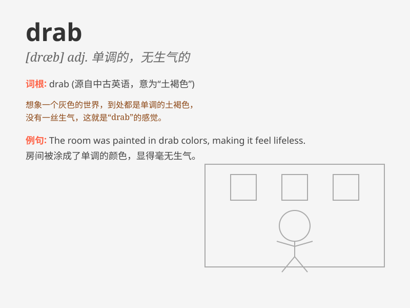

## drab

**英音:** _[dræb]_ **美音:** _[dræb]_

**译义:** *adj.土褐色的,单调的*

### 短语

+ **drab color:** _单调的颜色_

+ **drab dress:** _单调的连衣裙_

+ **drab life:** _枯燥的生活_

+ **drab scenery:** _单调的景色_

+ **drab personality:** _乏味的个性_

### 例句

#### 例句1

> **The room was decorated in drab colors.**

**中文翻译:** 这个房间用暗淡的颜色装饰。

**单词释义:** 暗淡的

#### 例句2

> **She wore a drab dress to the party.**

**中文翻译:** 她穿着一件单调的连衣裙去参加聚会。

**单词释义:** 单调的

#### 例句3

> **The town seemed drab and uninteresting.**

**中文翻译:** 这个城镇看起来沉闷无趣。

**单词释义:** 沉闷的

### 背诵小故事

> A girl was feeling very drab when she wore an old and plain dress to
the party. But then she changed into a colorful one and became lively.
Drab means dull and lacking color or excitement.

**一个女孩穿着老旧朴素的裙子去参加聚会时感到很单调乏味。但后来她换上了一件色彩鲜艳的裙子，变得活泼起来。drab
意思是单调的，无生气的，缺乏色彩或兴奋感。**

### 图义

