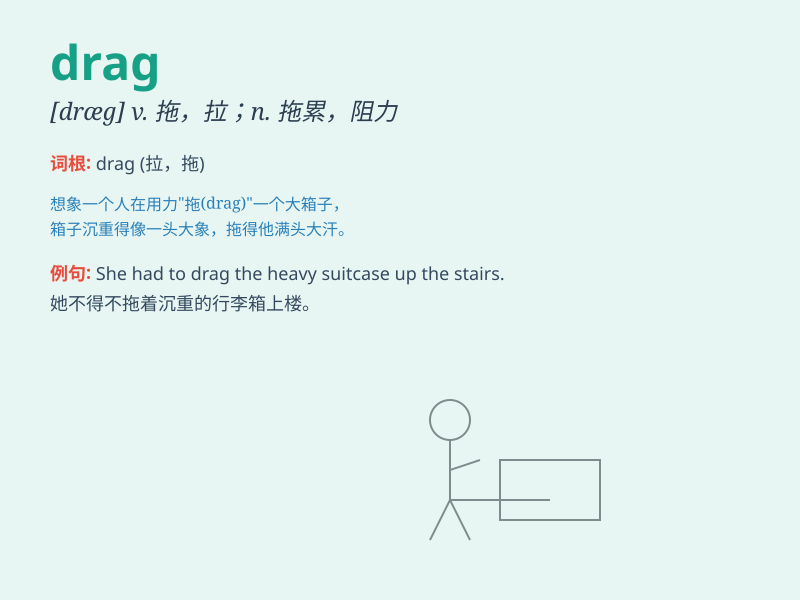

## drag

**英音:** _[dræg]_ **美音:** _[dræg]_

**译义:** *v.拖,拖曳,缓慢而费力地行动n.拖拉*

### 短语

+ **drag on:** _拖延；使拖延_

+ **drag out:** _拖长；拖延_

+ **drag in:** _把...拉进去；硬扯进_

+ **drag behind:** _落在后面_

+ **drag down:** _使...感到沮丧；使...衰弱_

### 例句

#### 例句1

> **The heavy box was difficult to drag across the floor.**

**中文翻译:** 这个沉重的箱子很难在地板上拖动。

**单词释义:** 拖，拉

#### 例句2

> **She felt that her job was dragging her down.**

**中文翻译:** 她觉得自己的工作把她拖垮了。

**单词释义:** 使（某人）感到乏味；使（某人）情绪低落

#### 例句3

> **The meeting seemed to drag on forever.**

**中文翻译:** 这次会议似乎没完没了地拖延着。

**单词释义:** （时间）过得很慢；拖沓地进行

### 背诵小故事

> A little mouse was trying to drag a big piece of cheese across the
floor. It was so heavy, but the mouse didn\'t give up. Finally, it
managed to drag the cheese to its hole. Here, \'drag\' means to pull
something along with effort.

**一只小老鼠正试图拖着一大块奶酪穿过地板。奶酪太重了，但老鼠没有放弃。最后，它成功地把奶酪拖到了它的洞里。这里，'drag'意思是费力地拉着某物。**

### 图义

