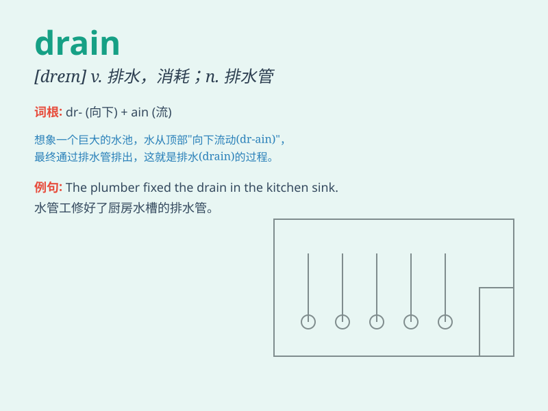

## drain

**英音:** _[dreɪn]_ **美音:** _[dren]_

**译义:** *n.排水沟,消耗,排水vt.排出沟外,喝干,耗尽vi.排水,流干*

### 短语

+ **drain away:** _流走；渐渐枯竭_

+ **drain off:** _排去；放干_

+ **drain out:** _排出；流光_

+ **brain drain:** _人才外流；智囊流失_

+ **drain pipe:** _排水管；泄水管_

### 例句

#### 例句1

> **The bathtub is draining slowly.**

**中文翻译:** 浴缸排水很慢。

**单词释义:** 排水；流干

#### 例句2

> **Her illness drained all her energy.**

**中文翻译:** 她的病耗尽了她所有的精力。

**单词释义:** 使耗尽；使枯竭

#### 例句3

> **The new road will drain traffic from the town center.**

**中文翻译:** 新的道路将会把交通从市中心引开。

**单词释义:** 使（液体、气体等）流走；排掉

### 背诵小故事

>
想象一下，一个巨大的游泳池水满了。为了清理它，我们打开排水口（drain），水就哗哗地流走。水不断流走，就像能量或精力被耗尽一样。所以drain
有排水、流干、耗尽的意思。

**想象一个游泳池排水的场景来辅助记忆单词drain，它有排水、流干、耗尽的意思。**

### 图义

