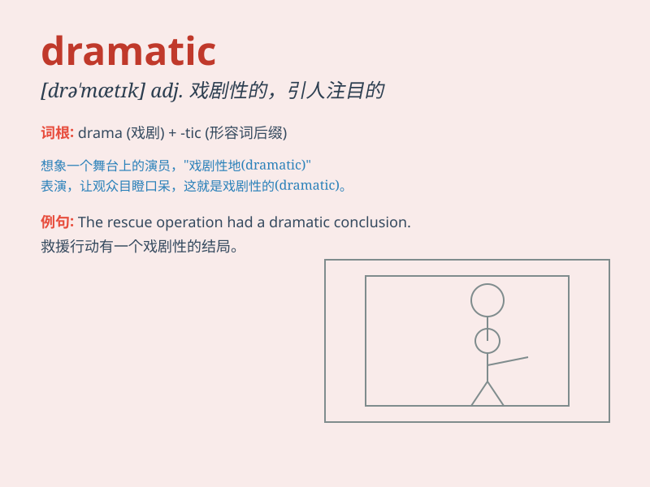

## dramatic

**英音:** _[drə\'mætɪk]_ **美音:** _[drə\'mætɪk]_

**译义:** *adj.戏剧性的,生动的*

### 短语

+ **dramatic change:** _巨大的变化_

+ **dramatic effect:** _显著的效果_

+ **dramatic increase:** _急剧增加_

+ **dramatic performance:** _精彩的表演_

+ **dramatic scene:** _戏剧性的场面_

### 例句

#### 例句1

> **The play had a dramatic ending.**

**中文翻译:** 这出戏有一个戏剧性的结局。

**单词释义:** 戏剧性的

#### 例句2

> **There has been a dramatic increase in crime in this area.**

**中文翻译:** 这个地区的犯罪率有了急剧的上升。

**单词释义:** 急剧的

#### 例句3

> **She made a dramatic entrance, wearing a long red dress.**

**中文翻译:** 她穿着一条红色的长裙，引人注目的登场了。

**单词释义:** 引人注目的

### 背诵小故事

> A young actor was always seeking a dramatic role. One day, he got the
chance in a play. His performance was so dramatic that the audience was
deeply moved. It was a turning point in his career.

**一位年轻的演员一直在寻求一个戏剧性的角色。有一天，他在一部剧中得到了机会。他的表演如此戏剧性，以至于观众深受感动。这是他职业生涯的一个转折点。**

### 图义

