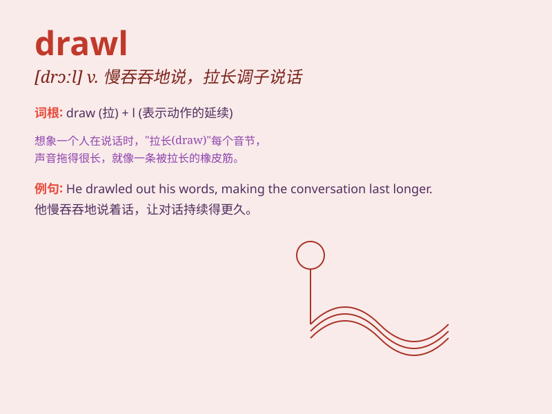

## drawl

**英音:** _[drɔːl]_ **美音:** _[drɔl]_

**译义:** *v.懒洋洋地说,做作而慢慢地说n.懒洋洋的说话态度*

### 短语

+ **drawl out:** _拉长；拖长_

+ **drawl something up:** _起草；拟定_

+ **slow drawl:** _缓慢而拉长的语调_

+ **Texas drawl:** _得克萨斯州式的拉长语调_

+ **drawl speech:** _拉长语调的讲话_

### 例句

#### 例句1

> **He has a slow southern drawl.**

**中文翻译:** 他说话带有慢吞吞的南方拖腔。

**单词释义:** 拖长腔调说话

#### 例句2

> **She drawled her words in a bored tone.**

**中文翻译:** 她以一种厌烦的语气拖长声音说话。

**单词释义:** 拖长（声音）

#### 例句3

> **The teacher drawled out the instructions.**

**中文翻译:** 老师缓慢而拖长声音地说出指令。

**单词释义:** 拉长语调说

### 背诵小故事

> A little boy was always drawling when he spoke. One day, his teacher
said, \'Stop drawling and speak clearly!\' The boy then tried to change.
Now you know \'drawl\' means to speak slowly and prolong the words.

**一个小男孩说话总是拖长音。有一天，他的老师说：'别拖长音了，说清楚！'然后男孩努力改正。现在你知道'drawl'就是指说话慢且拉长单词。**

### 图义

