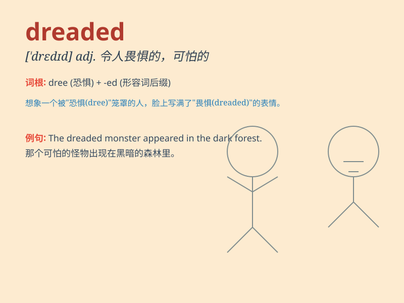

## dreaded

**英音:** _[ˈdredɪd]_ **美音:** _[ˈdredɪd]_

**译义:** *adj.令人恐惧的；可怕的（dread
的过去式及过去分词形式）；v.害怕（dread 的过去式及过去分词形式）*

### 短语

+ **dreaded disease:** _可怕的疾病_

+ **dreaded enemy:** _令人畏惧的敌人_

+ **dreaded task:** _可怕的任务_

+ **dreaded moment:** _令人恐惧的时刻_

+ **dreaded outcome:** _可怕的结果_

### 例句

#### 例句1

> **The dreaded exam was finally over.**

**中文翻译:** 令人害怕的考试终于结束了。

**单词释义:** 令人害怕的

#### 例句2

> **She faced the dreaded task of cleaning the attic.**

**中文翻译:** 她面临着清理阁楼这一可怕的任务。

**单词释义:** 可怕的

#### 例句3

> **The dreaded disease has no known cure.**

**中文翻译:** 这种可怕的疾病还没有已知的治愈方法。

**单词释义:** 可怕的

### 背诵小故事

> A brave knight was on a quest. The dreaded dragon appeared, breathing
fire. Everyone was scared, but the knight faced it bravely. Finally, the
knight defeated the dreaded monster and saved the kingdom.

**一位勇敢的骑士在执行任务。可怕的巨龙出现了，喷着火焰。所有人都很害怕，但骑士勇敢地面对它。最终，骑士打败了这只令人畏惧的怪物，拯救了王国。**

### 图义

