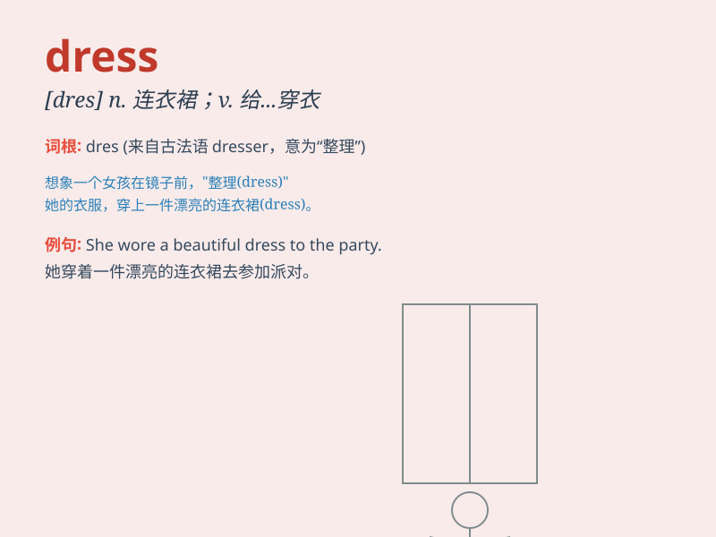

## dress

**英音:** _[dres]_ **美音:** _[drɛs]_

**译义:** *n.女服,童装,服装,衣服v.(给\...)穿衣*

### 短语

+ **dress up:** _盛装；打扮；装饰_

+ **dress code:** _着装要求；着装规范_

+ **dress rehearsal:** _彩排；预演_

+ **dress oneself:** _给自己穿衣服_

+ **dress in:** _穿着\...\..._

### 例句

#### 例句1

> **She always dresses elegantly for parties.**

**中文翻译:** 她参加聚会总是穿着优雅。

**单词释义:** 穿着

#### 例句2

> **Can you help me dress the wound?**

**中文翻译:** 你能帮我包扎伤口吗？

**单词释义:** 包扎

#### 例句3

> **The mother is dressing her baby.**

**中文翻译:** 这位母亲正在给她的宝宝穿衣服。

**单词释义:** 给\...\...穿衣服

### 背诵小故事

> A girl was very excited for a party. She opened her closet and chose
a beautiful dress. It was pink with flowers. She wore it and became the
star of the party.

**一个女孩为一场聚会感到非常兴奋。她打开衣柜，选了一件漂亮的连衣裙。它是带有花朵的粉色裙子。她穿上它，成为了聚会的明星。**

### 图义

