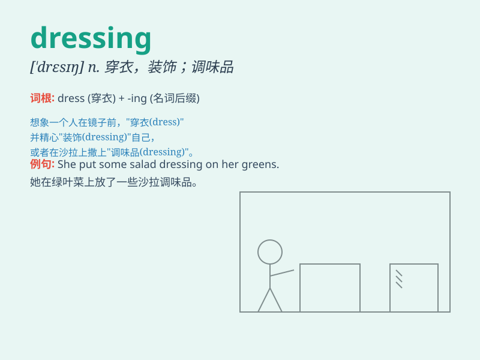

## dressing

**英音:** _[\'dresɪŋ]_ **美音:** _[\'drɛsɪŋ]_

**译义:** *n.穿衣,装饰,敷裹,敷料,调味品*

### 短语

+ **salad dressing:** _沙拉酱_

+ **wound dressing:** _伤口敷料_

+ **dressing table:** _梳妆台_

+ **dressing room:** _更衣室_

+ **dressing gown:** _晨衣；浴衣_

### 例句

#### 例句1

> **She is making a salad dressing.**

**中文翻译:** 她正在制作沙拉酱。

**单词释义:** 调料，酱汁

#### 例句2

> **The doctor applied a new dressing to the wound.**

**中文翻译:** 医生给伤口敷上了新的敷料。

**单词释义:** 敷料，包扎用品

#### 例句3

> **His dressing style is very fashionable.**

**中文翻译:** 他的穿着风格非常时尚。

**单词释义:** 穿着，打扮

### 背诵小故事

> One day, a chef was carefully preparing the dressing for a salad. He
mixed oil, vinegar, and various seasonings. The special dressing made
the salad very delicious. People loved it!

**一天，一位厨师正在精心准备沙拉的调料。他混合了油、醋和各种调味料。这种特别的调料让沙拉变得非常美味。人们都很喜欢！**

### 图义

