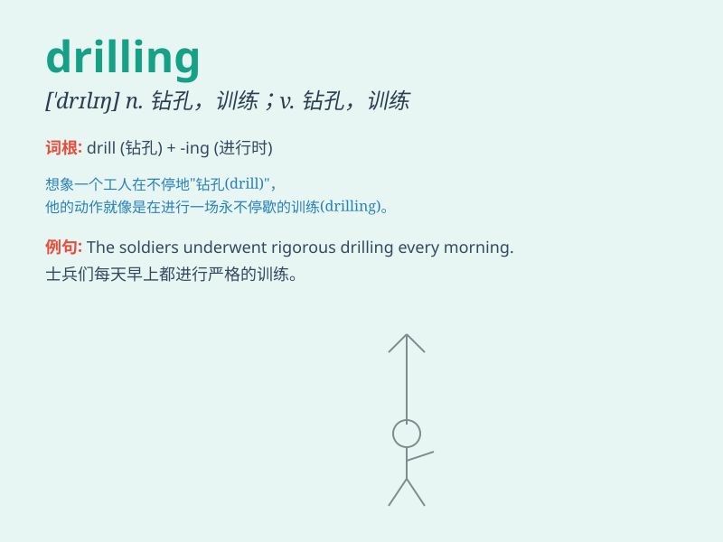

## drilling

**英音:** _[ˈdrɪlɪŋ]_ **美音:** _[ˈdrɪlɪŋ]_

**译义:** *n.演练*

### 短语

+ **drilling machine:** _钻床；钻孔机_

+ **drilling rig:** _钻井平台；钻探设备_

+ **drilling fluid:** _钻井液；钻孔液_

+ **oil drilling:** _石油钻探_

+ **drilling hole:** _钻孔_

### 例句

#### 例句1

> **The workers are doing drilling in the oil field.**

**中文翻译:** 工人们正在油田里进行钻探。

**单词释义:** 钻探

#### 例句2

> **She spent hours drilling math problems.**

**中文翻译:** 她花了几个小时练习数学题。

**单词释义:** 练习

#### 例句3

> **The dentist is doing a drilling on my tooth.**

**中文翻译:** 牙医正在给我的牙齿钻孔。

**单词释义:** 钻孔

### 背诵小故事

> A team of workers was engaged in drilling deep into the earth. They
were sweating but persistent, as the drilling operation was crucial for
finding precious resources. The sound of drilling echoed loudly.

**一组工人正在进行深入地下的钻探工作。他们汗流浃背但坚持不懈，因为钻探行动对于寻找珍贵资源至关重要。钻探的声音响亮地回荡着。**

### 图义

