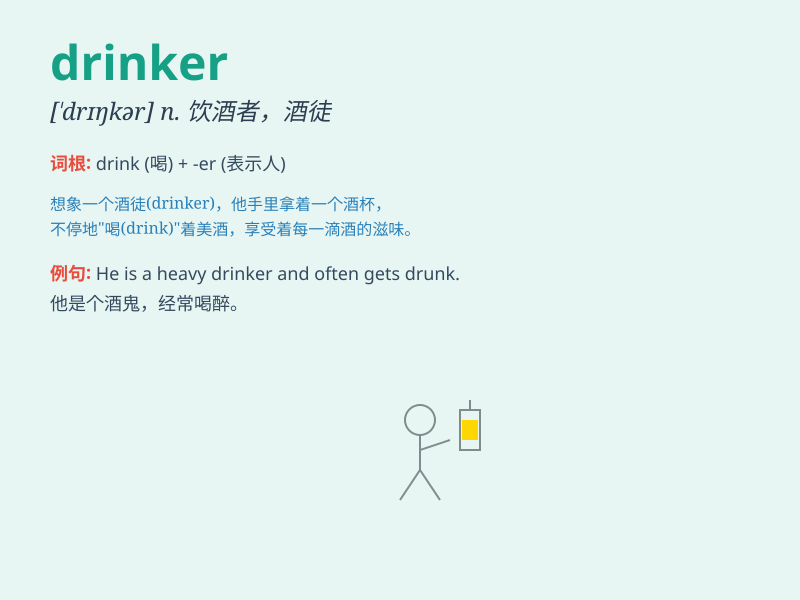

## drinker

**英音:** _[\'drɪŋkə]_ **美音:** _[\'drɪŋkɚ]_

**译义:** *n.喝的人,酒徒*

### 短语

+ **heavy drinker:** _酗酒者；酒量大的人_

+ **social drinker:** _社交性饮酒者；偶尔喝酒的人_

+ **moderate drinker:** _适度饮酒者_

+ **chain drinker:** _连续不断喝酒的人_

+ **problem drinker:** _有饮酒问题的人_

### 例句

#### 例句1

> **He is a heavy drinker and it\'s affecting his health.**

**中文翻译:** 他是个酗酒者，这正在影响他的健康。

**单词释义:** 酗酒者

#### 例句2

> **The bar attracts all kinds of drinkers, from casual to
serious.**

**中文翻译:**
这家酒吧吸引了各种各样的饮酒者，从随意喝一点的到很认真喝酒的都有。

**单词释义:** 饮酒者

#### 例句3

> **She\'s not a drinker and prefers juice to wine.**

**中文翻译:** 她不是个爱喝酒的人，比起葡萄酒她更喜欢果汁。

**单词释义:** 爱喝酒的人

### 背诵小故事

> One day, a thirsty traveler was walking in the desert. When he
finally found an oasis, he became a drinker, gulping down water
greedily. He knew that as a drinker, he needed to cherish every drop to
survive.

**有一天，一个口渴的旅行者在沙漠中行走。当他终于找到一片绿洲时，他变成了一个饮水者，贪婪地大口喝水。他知道作为一个饮水者，他需要珍惜每一滴水才能生存。**

### 图义

