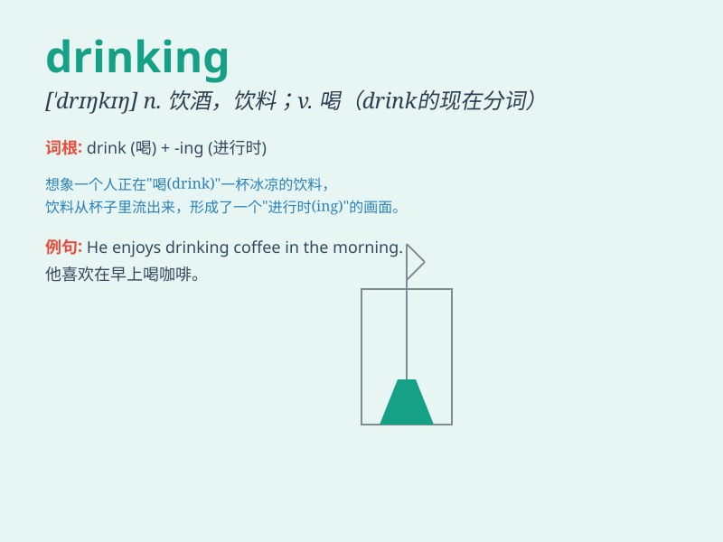

## drinking

**英音:** _[\'drɪŋkɪŋ]_ **美音:** _[\'drɪŋkɪŋ]_

**译义:** *n.喝,喝酒*

### 短语

+ **drinking water:** _饮用水_

+ **drinking habit:** _饮酒习惯；饮水习惯_

+ **drinking party:** _酒会_

+ **drinking fountain:** _（设于公共场所的）喷泉式饮水器_

+ **heavy drinking:** _酗酒；大量饮酒_

### 例句

#### 例句1

> **I\'m not used to drinking coffee in the morning.**

**中文翻译:** 我不习惯在早上喝咖啡。

**单词释义:** 喝咖啡

#### 例句2

> **He was caught drinking and driving.**

**中文翻译:** 他被抓到酒驾。

**单词释义:** 喝酒

#### 例句3

> **The children are drinking juice happily.**

**中文翻译:** 孩子们正在开心地喝果汁。

**单词释义:** 喝果汁

### 背诵小故事

> One day, Tom was very thirsty. So he went to a store and bought a
bottle of juice. He started drinking it quickly and felt refreshed.
Drinking the juice made him happy.

**有一天，汤姆非常口渴。于是他去了一家商店买了一瓶果汁。他开始快速地喝起来，感觉神清气爽。喝果汁让他很开心。**

### 图义

