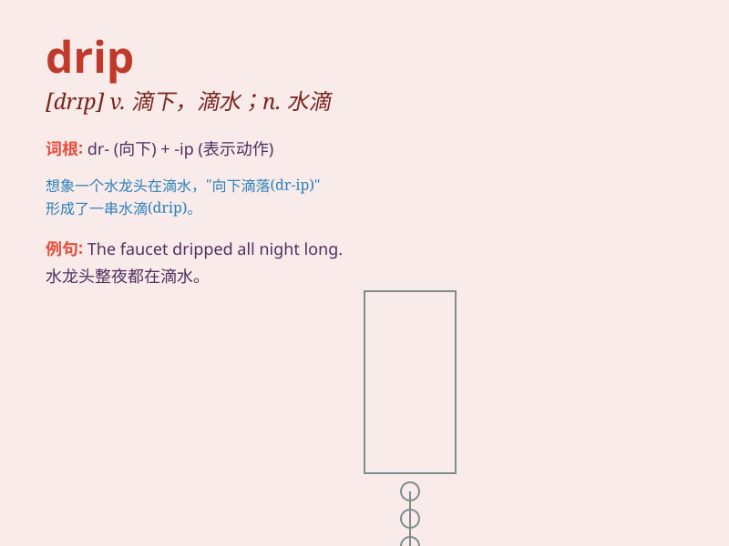

## drip

**英音:** _[drɪp]_ **美音:** _[drɪp]_

**译义:** *n.水滴v.(使)滴下*

### 短语

+ **drip coffee:** _滴滤咖啡_

+ **drip irrigation:** _滴灌_

+ **drip feed:** _点滴式供给_

+ **drip dry:** _（衣服）滴干_

+ **drip with something:** _充满，大量流淌（某物）_

### 例句

#### 例句1

> **The tap is dripping and needs to be fixed.**

**中文翻译:** 水龙头在滴水，需要修理。

**单词释义:** 滴下，滴水

#### 例句2

> **Raindrops were dripping from the leaves.**

**中文翻译:** 雨滴从树叶上滴下来。

**单词释义:** （使）滴下

#### 例句3

> **She was dripping with sweat after the workout.**

**中文翻译:** 锻炼之后她浑身是汗。

**单词释义:** 充满，充溢（常与 with 连用）

### 背诵小故事

> A little bird was injured and lay on the ground. Drops of blood
dripped from its wing. A kind girl found it and took it to the doctor.

**一只小鸟受伤躺在地上。血从它的翅膀一滴一滴地滴下来。一个善良的女孩发现了它，并带它去看医生。**

### 图义

