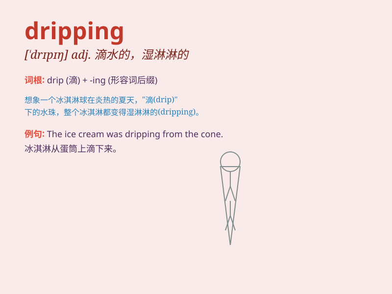

## dripping

**英音:** _[\'drɪpɪŋ]_ **美音:** _[\'drɪpɪŋ]_

**译义:** *n.滴,滴下,滴下物,油滴*

### 短语

+ **dripping wet:** _湿透的_

+ **dripping pan:** _滴油盘；盛液盘_

+ **dripping faucet:** _滴水的水龙头_

+ **dripping roast:** _油淋烤肉_

+ **dripping with sweat:** _汗流浃背_

### 例句

#### 例句1

> **The faucet was dripping and needed to be fixed.**

**中文翻译:** 水龙头在滴水，需要修理。

**单词释义:** 滴水

#### 例句2

> **She could hear the dripping of the rain on the roof.**

**中文翻译:** 她能听到雨水在屋顶上滴落的声音。

**单词释义:** 滴落

#### 例句3

> **The meat was still dripping with juice.**

**中文翻译:** 这块肉还在滴着汁水。

**单词释义:** 滴下

### 背诵小故事

> One rainy day, I was walking under a tree. Suddenly, water started
dripping from the leaves onto my head. I looked up and saw the drops
falling continuously. That\'s how I remember \'dripping\' - the act of
liquid falling in drops.

**在一个下雨天，我走在一棵树下。突然，水开始从树叶上滴到我头上。我抬头看，看到水滴不停地落下。这就是我记住"dripping"这个词的方式------液体成滴落下的动作。**

### 图义

