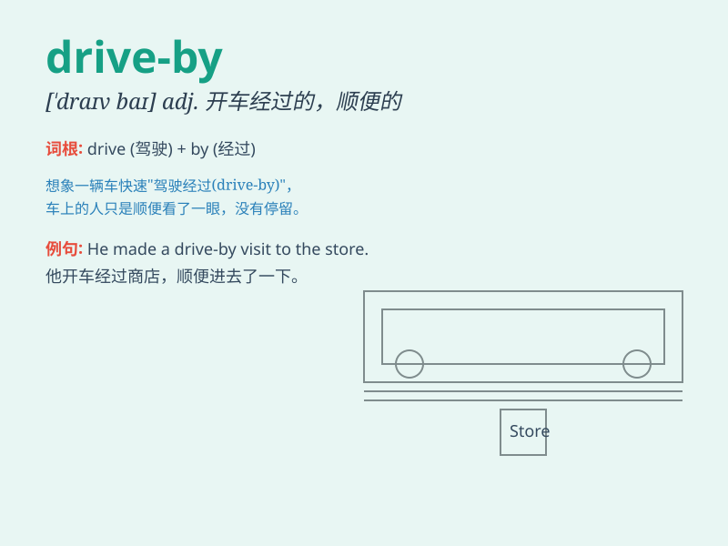

## drive-by

**英音:** _[draɪv baɪ]_ **美音:** _[draɪv baɪ]_

**译义:** *n. 驾车经过；驾车袭击；adj. 驾车经过的；驾车袭击的；v.
驾车经过；驾车袭击*

### 短语

+ **drive-by shooting:** _飞车枪击_

+ **drive-by download:**
_路过式下载（用户在浏览网页时，恶意软件在未经用户同意的情况下自动下载到用户计算机上）_

+ **drive-by inspection:** _路过式检查_

+ **drive-by attack:** _路过式攻击_

+ **drive-by viewing:** _路过式观看_

### 例句

#### 例句1

> **The drive-by shooting shocked the entire neighborhood.**

**中文翻译:** 这起驾车枪击事件震惊了整个社区。

**单词释义:** 驾车经过时的（射击等行为）

#### 例句2

> **We got a drive-by inspection from the boss today.**

**中文翻译:** 今天老板对我们进行了一次路过式的检查。

**单词释义:** 路过式的

#### 例句3

> **The drive-by comment hurt her feelings.**

**中文翻译:** 那随口一说的评论伤害了她的感情。

**单词释义:** 随口的，路过时随口说的

### 背诵小故事

> One night, I was walking on the street. Suddenly, a car passed by
very fast. It was a drive-by. The people in the car shouted something
and disappeared. I was shocked. Later I knew it meant a quick and
passing action.

**一天晚上，我正在街上走。突然，一辆车飞速驶过。这就是'drive-by'。车里的人喊了些什么然后就消失了。我很震惊。后来我知道它指的是快速且短暂路过的行为。**

### 图义

