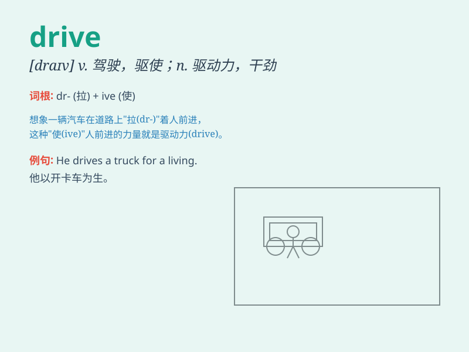

## drive

**英音:** _[draɪv]_ **美音:** _[draɪv]_

**译义:**
*n.驾车,驱动器,快车道,推进力,驱使,动力,干劲,击球vt.开车,驱赶,推动、发动(机器等),驾驶(马车,汽车等)vi.开车,猛击,飞跑n.[计]驱动器*

### 短语

+ **drive away:** _赶走；驱车离开_

+ **drive out:** _驱逐；开车外出_

+ **drive through:** _驱车穿过；（在餐馆等）得来速式的_

+ **drive up:** _使上涨；驱车来到_

+ **hard drive:** _（电脑）硬盘驱动器_

### 例句

#### 例句1

> **He drives to work every day.**

**中文翻译:** 他每天开车去上班。

**单词释义:** 驾驶；开车

#### 例句2

> **The bad weather is driving tourists away.**

**中文翻译:** 恶劣的天气正在赶走游客。

**单词释义:** 迫使；驱使

#### 例句3

> **She has a strong drive to succeed.**

**中文翻译:** 她有强烈的成功欲望。

**单词释义:** 欲望；动力

### 背诵小故事

> One day, I decided to drive my car to a beautiful beach. The drive
was long but enjoyable. I saw many wonderful scenes along the way.
Finally, I reached the destination and had a great time.

**有一天，我决定开着我的车去一个美丽的海滩。这次驾驶路程很长但很愉快。一路上我看到了许多美妙的景色。最终，我到达了目的地，玩得很开心。**

### 图义

