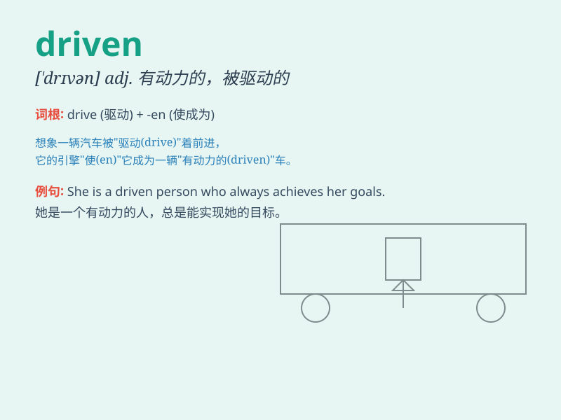

## driven

**英音:** _[\'drɪvn]_ **美音:** _[\'drɪvn]_

**译义:** *adj.受到驱策的 vbl.drive的过去分词*

### 短语

+ **driven snow:** _洁白的雪_

+ **performance-driven:** _以绩效为导向的_

+ **goal-driven:** _目标驱动的_

+ **data-driven:** _数据驱动的_

+ **customer-driven:** _以客户为导向的_

### 例句

#### 例句1

> **She is a very goal-driven person.**

**中文翻译:** 她是一个非常有目标驱动的人。

**单词释义:** 受驱动的；有强烈目标的

#### 例句2

> **The snowstorm has driven many people indoors.**

**中文翻译:** 暴风雪迫使许多人待在室内。

**单词释义:** 迫使；驱使

#### 例句3

> **He is driven by a passion for music.**

**中文翻译:** 他被对音乐的热情所驱动。

**单词释义:** 被\...\...驱动；受\...\...驱使

### 背诵小故事

> A young man was very driven to become a great musician. He practiced
every day, never giving up. His driven spirit led him to success on the
stage.

**一个年轻人非常有动力去成为一名伟大的音乐家。他每天练习，从不放弃。他这种有冲劲的精神使他在舞台上获得成功。**

### 图义

