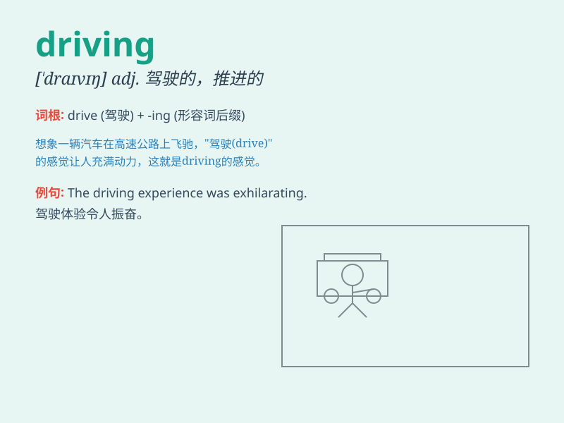

## driving

**英音:** _[\'draɪvɪŋ]_ **美音:** _[\'draɪvɪŋ]_

**译义:** *n.操纵,驾驶adj.推进的,强劲的,精力旺盛的*

### 短语

+ **driving license:** _驾驶执照_

+ **driving force:** _驱动力；推动力_

+ **driving range:** _（高尔夫球等的）击球距离；汽车的续航里程_

+ **driving test:** _驾驶考试_

+ **driving seat:** _驾驶座；控制地位_

### 例句

#### 例句1

> **I enjoy driving on the open road.**

**中文翻译:** 我喜欢在开阔的道路上驾驶。

**单词释义:** 驾驶

#### 例句2

> **Driving too fast is dangerous.**

**中文翻译:** 开车太快是危险的。

**单词释义:** 开车

#### 例句3

> **She has excellent driving skills.**

**中文翻译:** 她有出色的驾驶技能。

**单词释义:** 驾驶

### 背诵小故事

> One day, I was on a long journey. The driving was smooth until a
sudden storm came. But my determination kept me going. Finally, I
reached my destination safely. Driving means operating a vehicle to move
forward.

**有一天，我在长途旅行。驾驶起初很顺利，直到突然来了一场暴风雨。但我的决心让我继续前进。最后，我安全抵达目的地。Driving
意思是驾驶车辆前进。**

### 图义

