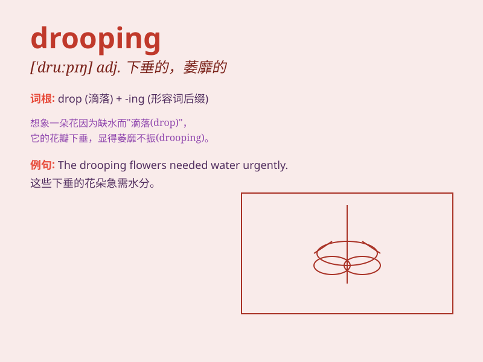

## drooping

**英音:** _[ˈdruːpɪŋ]_ **美音:** _[ˈdruːpɪŋ]_

**译义:** *adj.下垂的,无力的*

### 短语

+ **drooping eyelid:** _下垂的眼睑_

+ **drooping branches:** _下垂的树枝_

+ **drooping flowers:** _低垂的花朵_

+ **drooping spirits:** _萎靡的精神_

+ **drooping posture:** _低垂的姿势_

### 例句

#### 例句1

> **The flowers were drooping in the heat.**

**中文翻译:** 这些花在高温下低垂着。

**单词释义:** 低垂；下垂

#### 例句2

> **His shoulders were drooping with exhaustion.**

**中文翻译:** 他的肩膀因疲惫而下垂。

**单词释义:** 下垂；耷拉

#### 例句3

> **The branches of the old tree were drooping low.**

**中文翻译:** 那棵老树的树枝低垂得很低。

**单词释义:** 低垂；下弯

### 背诵小故事

> A little bird was flying in the sky. But it was too tired and its
wings started drooping. It struggled to keep going but finally had to
land on a branch to rest. Poor bird!

**一只小鸟在天空中飞翔。但它太累了，翅膀开始下垂。它努力坚持，但最终不得不落在一根树枝上休息。可怜的小鸟！**

### 图义

