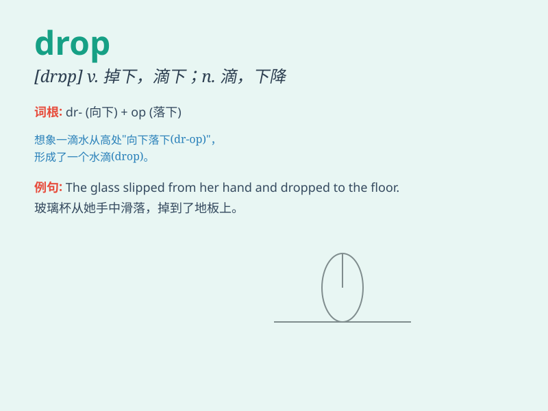

## drop

**英音:** _[drɒp]_ **美音:** _[drɑp]_

**译义:**
*v.滴下,落下,(使声音等)变弱,(使价格等)下降,使跌倒,使结束,不再讨论,停止与(某人)交往n.落下,下降,滴,滴剂,点滴,微量,下跌*

### 短语

+ **drop in:** _顺便拜访_

+ **drop out:** _退学；退出_

+ **drop off:** _减少；让\...\...下车_

+ **drop behind:** _落后；落伍_

+ **drop by:** _顺便走访_

### 例句

#### 例句1

> **The temperature dropped suddenly last night.**

**中文翻译:** 昨晚温度突然下降了。

**单词释义:** 下降；降低

#### 例句2

> **She dropped the glass and it broke.**

**中文翻译:** 她把玻璃杯掉在地上打碎了。

**单词释义:** 掉落；掉下

#### 例句3

> **I\'ll drop you off at the train station.**

**中文翻译:** 我会在火车站让你下车。

**单词释义:** 让\...\...下车

### 背诵小故事

> One day, I was walking in the park. Suddenly, a bird flew by and
dropped an apple right in front of me. I picked it up and realized that
sometimes good things can drop unexpectedly.

**一天，我在公园散步。突然，一只鸟飞过，掉落了一个苹果正好在我面前。我捡起它，意识到有时好东西会意外掉落。**

### 图义

