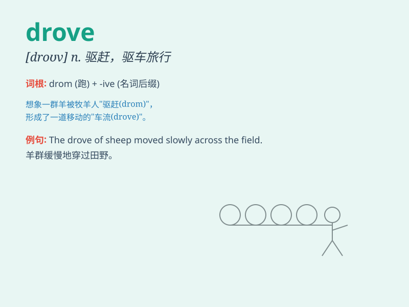

## drove

**英音:** _[drəʊv]_ **美音:** _[drov]_

**译义:** * vbl.drive的过去式n.畜群*

### 短语

+ **drove off:** _赶走；驾车离去_

+ **drove out:** _逐出；乘车出去_

+ **drove away:** _赶走；开走_

+ **drove through:** _驱车穿过；开车通过_

+ **drove up:** _驱车来到；使上升_

### 例句

#### 例句1

> **He drove his car to work yesterday.**

**中文翻译:** 他昨天开车去上班。

**单词释义:** 驾驶（过去式）

#### 例句2

> **The cattle drove slowly along the road.**

**中文翻译:** 牛群沿着路慢慢地走。

**单词释义:** 驱赶

#### 例句3

> **The wind drove the clouds away.**

**中文翻译:** 风把云吹散了。

**单词释义:** 迫使

### 背诵小故事

> One day, I was lost in a strange town. A kind man in a car drove me
to the right place. His act of driving me safely made me very grateful.

**有一天，我在一个陌生的城镇迷路了。一位好心的男人开车把我送到了正确的地方。他开车送我安全抵达的举动让我非常感激。**

### 图义

