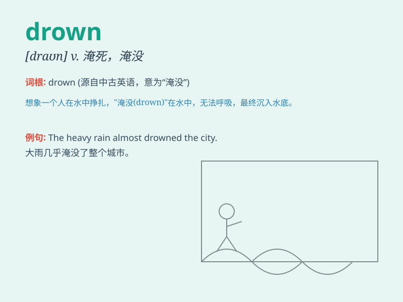

## drown

**英音:** _[draʊn]_ **美音:** _[draʊn]_

**译义:** *v.溺死,淹死vt.淹没*

### 短语

+ **drown out:** _（声音）盖过，淹没_

+ **drown in:** _沉浸于；淹没在_

+ **drown oneself:** _投水（自杀）_

+ **be drowned:** _被淹死；被淹没_

+ **drown one\'s sorrows:** _借酒浇愁_

### 例句

#### 例句1

> **He almost drowned when he fell into the river.**

**中文翻译:** 他掉进河里时差点淹死。

**单词释义:** 淹死

#### 例句2

> **The noise of the traffic drowned out our conversation.**

**中文翻译:** 交通的嘈杂声淹没了我们的谈话。

**单词释义:** 淹没

#### 例句3

> **She tried to drown her sorrows in alcohol.**

**中文翻译:** 她试图借酒消愁。

**单词释义:** 消除，淹没（情感）

### 背诵小故事

> A man was swimming in the deep river. Suddenly, a strong current
pulled him under. He struggled but couldn\'t reach the surface.
Eventually, he drowned. Poor guy!

**一个男人在深河里游泳。突然，一股强大的水流把他拉了下去。他挣扎着，但无法到达水面。最终，他溺水身亡了。可怜的家伙！**

### 图义

