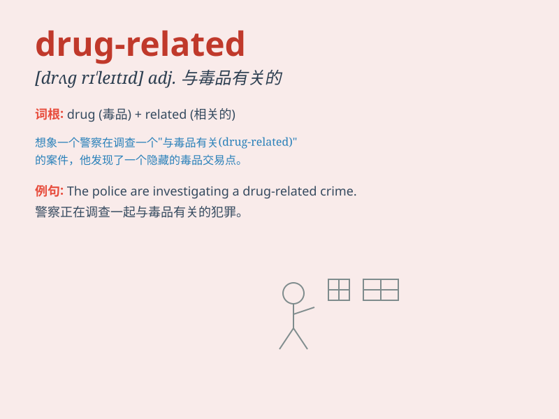

## drug-related

**英音:** _[drʌɡ rɪˈleɪtɪd]_ **美音:** _[drʌɡ
rɪˈleɪtɪd]_

**译义:** *与毒品有关的；和毒品相关的*

### 短语

+ **drug-related crime:** _与毒品有关的犯罪_

+ **drug-related incident:** _与毒品有关的事件_

+ **drug-related problem:** _与毒品有关的问题_

+ **drug-related death:** _与毒品有关的死亡_

+ **drug-related activity:** _与毒品有关的活动_

### 例句

#### 例句1

> **The police are cracking down on drug-related crimes.**

**中文翻译:** 警方正在严厉打击与毒品有关的犯罪。

**单词释义:** 与毒品有关的

#### 例句2

> **There has been an increase in drug-related deaths in this
area.**

**中文翻译:** 这个地区与毒品有关的死亡人数有所增加。

**单词释义:** 与毒品有关的

#### 例句3

> **She was involved in drug-related activities and got arrested.**

**中文翻译:** 她参与了与毒品有关的活动并被逮捕了。

**单词释义:** 与毒品有关的

### 背诵小故事

> A detective was investigating a crime. All clues pointed to something
drug-related. He found mysterious powders and strange phone calls.
Finally, he cracked the case and caught the drug-related criminals.

**一位侦探正在调查一起犯罪案件。所有线索都指向与毒品有关的事。他发现了神秘的粉末和奇怪的电话。最终，他破了案并抓住了与毒品有关的罪犯。**

### 图义

