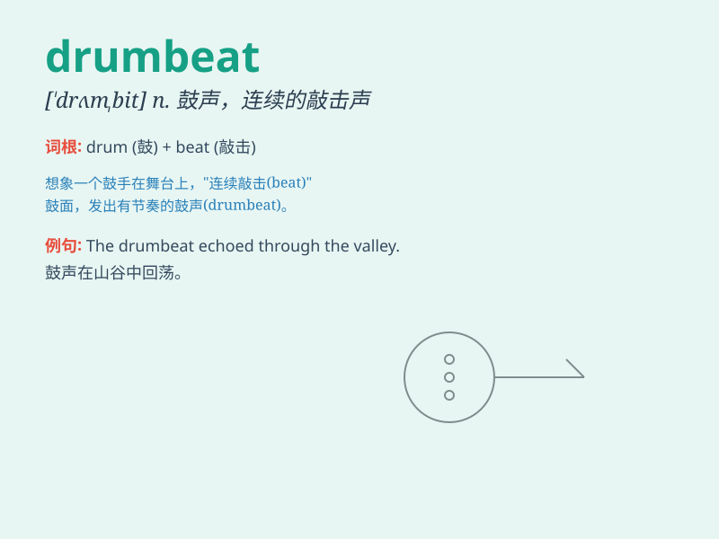

## drumbeat

**英音:** _[\'drʌmbiːt]_ **美音:** _[\'drʌmbit]_

**译义:** *n.鼓声,打鼓*

### 短语

+ **constant drumbeat:** _持续不断的鼓点_

+ **loud drumbeat:** _响亮的鼓点_

+ **rhythmic drumbeat:** _有节奏的鼓点_

+ **marching drumbeat:** _行军鼓点_

+ **fierce drumbeat:** _激烈的鼓点_

### 例句

#### 例句1

> **The drumbeat echoed through the empty street, creating an eerie
atmosphere.**

**中文翻译:** 鼓声在空荡荡的街道上回荡，营造出一种怪异的氛围。

**单词释义:** 鼓声

#### 例句2

> **The politician\'s speech was accompanied by a steady drumbeat of
promises.**

**中文翻译:** 这位政治家的演讲伴随着一连串坚定的承诺。

**单词释义:** 一连串（类似鼓声的节奏）

#### 例句3

> **The constant drumbeat of bad news is taking a toll on people\'s
morale.**

**中文翻译:** 持续不断的坏消息像鼓点一样冲击着人们的士气。

**单词释义:** 持续不断的（类似鼓点的节奏）

### 背诵小故事

> A brave drummer was in a big battle. He played the drumbeat loudly
and powerfully. His drumbeat inspired the soldiers and led them to
victory. The continuous drumbeat became the symbol of hope and courage.

**一位勇敢的鼓手在一场大战中。他用力地、响亮地击打着鼓点。他的鼓点激励着士兵们，并带领他们走向胜利。持续的鼓点成为了希望和勇气的象征。**

### 图义

