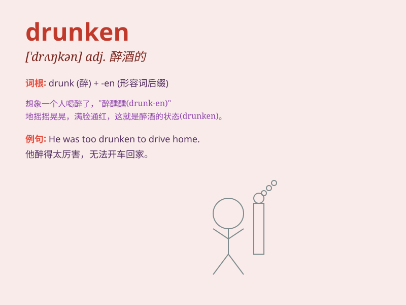

## drunken

**英音:** _[\'drʌŋk(ə)n]_ **美音:** _[\'drʌŋkən]_

**译义:** *adj.酒醉的*

### 短语

+ **drunken driving:** _酒后驾车_

+ **drunken brawl:** _酒后斗殴_

+ **drunken stupor:** _酒醉昏迷_

+ **drunken revelry:** _醉酒狂欢_

+ **drunken sailor:** _醉醺醺的水手_

### 例句

#### 例句1

> **He was arrested for drunken driving.**

**中文翻译:** 他因醉酒驾车被捕。

**单词释义:** 醉酒的

#### 例句2

> **The drunken man staggered along the street.**

**中文翻译:** 那个醉汉在街上蹒跚而行。

**单词释义:** 喝醉的

#### 例句3

> **She had a drunken argument with her friend last night.**

**中文翻译:** 昨晚她和朋友有一场酒后争吵。

**单词释义:** 酒醉引起的

### 背诵小故事

> A man went to a party and had too much to drink. He became drunken
and started dancing strangely. Everyone laughed but he didn\'t care. The
next day, he had a bad headache and regretted his drunken behavior.

**一个男人去参加派对，喝了太多酒。他变得醉醺醺的，开始奇怪地跳舞。每个人都笑了，但他不在乎。第二天，他头痛得厉害，后悔自己醉酒的行为。**

### 图义

