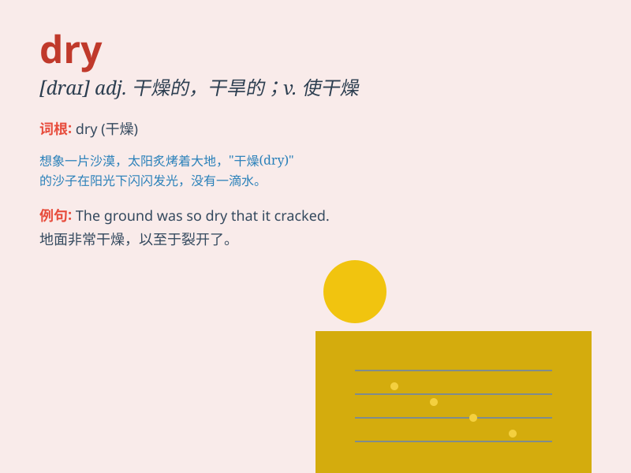

## dry

**英音:** _[draɪ]_ **美音:** _[draɪ]_

**译义:** *adj.干的,干燥的,口渴的vt.(使)干燥,(使)变干v.干燥*

### 短语

+ **dry out:** _（使）变干；干透_

+ **dry up:** _（河流、湖泊等）干涸；（供应）枯竭_

+ **dry off:** _（使）变干；擦干_

+ **dry cleaning:** _干洗_

+ **bone dry:** _干透；非常干燥_

### 例句

#### 例句1

> **The weather is very dry these days.**

**中文翻译:** 这些天天气非常干燥。

**单词释义:** 干燥的

#### 例句2

> **Please dry your hands before touching the computer.**

**中文翻译:** 在触摸电脑前请擦干你的手。

**单词释义:** 使干燥；擦干

#### 例句3

> **The river has dried up due to the lack of rain.**

**中文翻译:** 由于缺少雨水，这条河已经干涸了。

**单词释义:** （使）干涸

### 背诵小故事

> A traveler was in the desert. His water bottle was empty and the sun
was hot. Everything around him was dry. No water, no green plants. He
really needed to find a way out of this dry place.

**一位旅行者身处沙漠。他的水瓶空了，太阳炽热。他周围的一切都很干燥。没有水，没有绿色植物。他真的需要找到走出这个干燥之地的办法。**

### 图义

