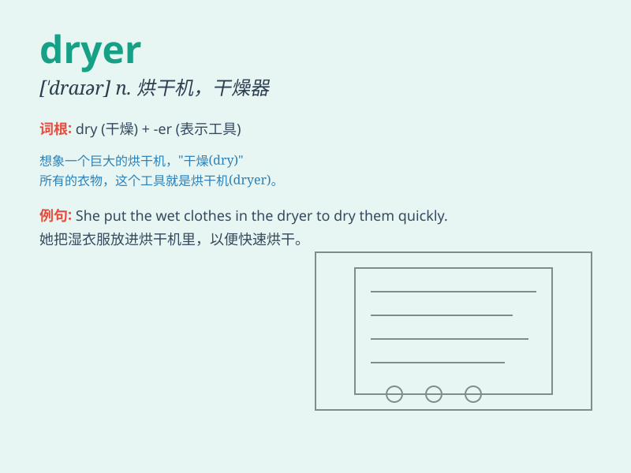

## dryer

**英音:** _[\'draɪə]_ **美音:** _[\'draɪɚ]_

**译义:** *n.干衣机,干燥剂*

### 短语

+ **hair dryer:** _吹风机；风筒_

+ **clothes dryer:** _干衣机_

+ **tumble dryer:** _滚筒式烘干机_

+ **hand dryer:** _烘手器_

+ **gas dryer:** _煤气烘干机_

### 例句

#### 例句1

> **The dryer is not working properly.**

**中文翻译:** 烘干机工作不正常。

**单词释义:** 烘干机

#### 例句2

> **I need to buy a new hair dryer.**

**中文翻译:** 我需要买一个新的吹风机。

**单词释义:** 吹风机

#### 例句3

> **The clothes dryer consumes a lot of electricity.**

**中文翻译:** 这个衣物烘干机耗电很多。

**单词释义:** 衣物烘干机

### 背诵小故事

> One day, my clothes were wet after washing. I needed the dryer to
make them dry quickly. I put the clothes in the dryer and turned it on.
Soon, they became dry and ready to wear.

**有一天，我的衣服洗完后是湿的。我需要烘干机让它们快速变干。我把衣服放进烘干机然后打开。很快，它们就干了可以穿了。**

### 图义

