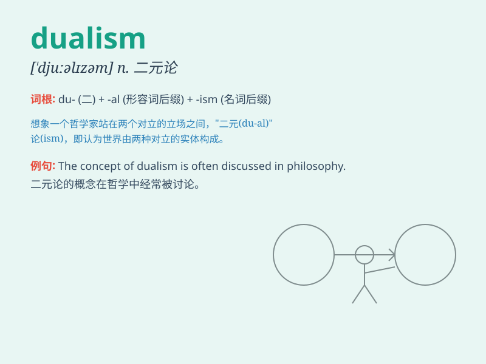

## dualism

**英音:** _[\'djuːəlɪz(ə)m]_ **美音:** _[\'duəlɪzəm]_

**译义:** *n.二元论*

### 短语

+ **mind-body dualism:** _心身二元论_

+ **ethical dualism:** _伦理二元论_

+ **metaphysical dualism:** _形而上学的二元论_

+ **value dualism:** _价值二元论_

+ **epistemological dualism:** _认识论二元论_

### 例句

#### 例句1

> **The philosophy of dualism posits a clear separation between mind
and body.**

**中文翻译:** 二元论的哲学认为心灵和身体有明确的分离。

**单词释义:** 二元论

#### 例句2

> **His thinking shows a certain dualism when it comes to moral
issues.**

**中文翻译:** 在道德问题上，他的思维表现出某种二元性。

**单词释义:** 二元性

#### 例句3

> **The novel explores the dualism of good and evil in human
nature.**

**中文翻译:** 这部小说探讨了人性中善与恶的二元对立。

**单词释义:** 二元对立

### 背诵小故事

> In a magical forest, there were two distinct forces, light and
darkness. This clear division represented \'dualism\'. It showed that
things often exist in pairs of opposites, like good and bad, hot and
cold.

**在一个神奇的森林里，有两种截然不同的力量，光明和黑暗。这种明显的划分代表了"二元论"。它表明事物经常以成对的对立面存在，如好与坏，热与冷。**

### 图义

