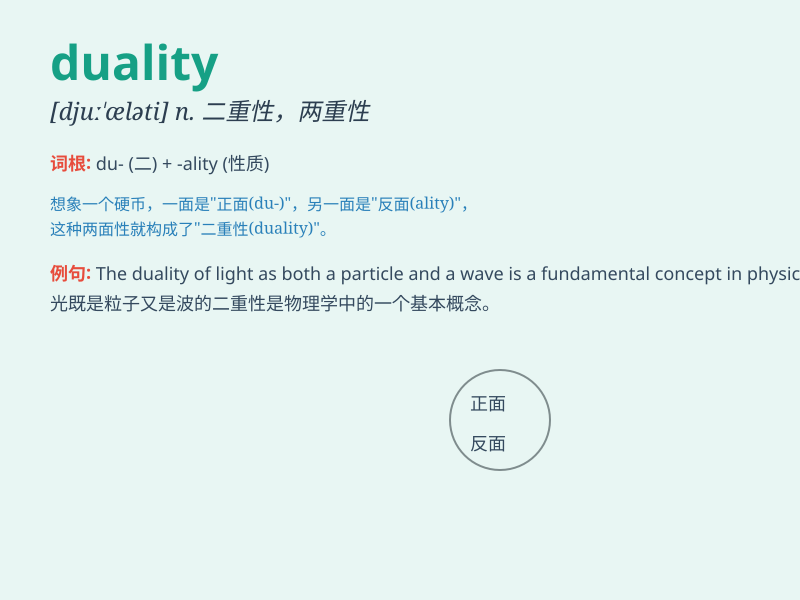

## duality

**英音:** _[djuː\'ælɪtɪ]_ **美音:** _[du\'æləti]_

**译义:** *n.二元性*

### 短语

+ **concept of duality:** _二元性的概念_

+ **duality principle:** _对偶原理_

+ **mind-body duality:** _身心二元论_

+ **wave-particle duality:** _波粒二象性_

+ **spatial duality:** _空间二元性_

### 例句

#### 例句1

> **The duality of human nature has been a subject of philosophical
debate for centuries.**

**中文翻译:** 人性的双重性几个世纪以来一直是哲学辩论的主题。

**单词释义:** 双重性；二元性

#### 例句2

> **There is a duality in her personality---she\'s both confident and
shy.**

**中文翻译:** 她的性格具有双重性------既自信又害羞。

**单词释义:** 双重性；二元性

#### 例句3

> **The novel explores the duality of good and evil.**

**中文翻译:** 这部小说探讨了善与恶的二元性。

**单词释义:** 二元性；双重性

### 背诵小故事

> A young artist was confused by the duality of his feelings for his
art. Sometimes he loved the freedom it gave, but sometimes he hated the
pressure. This confusion made him deeply understand the meaning of
\'duality\'.

**一位年轻的艺术家对他对艺术的感情的双重性感到困惑。有时他喜欢它带来的自由，但有时他讨厌这种压力。这种困惑使他深刻理解了"双重性"的含义。**

### 图义

