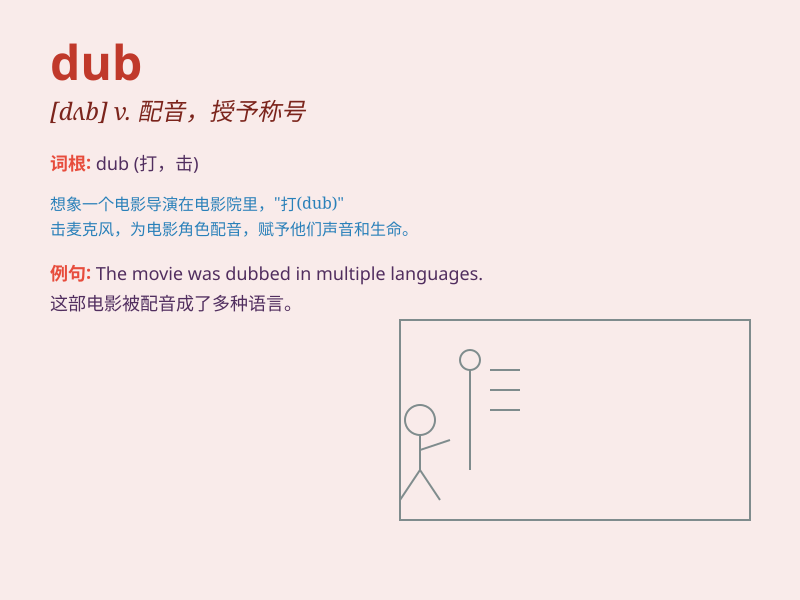

## dub

**英音:** _[dʌb]_ **美音:** _[dʌb]_

**译义:** *vt.[电影]配音,轻点,授予称号,打击n.鼓声,笨蛋*

### 短语

+ **dub sth into:** _给...配音；把...译成_

+ **dub sb/sth as:** _把某人/某物称作_

+ **dub out:** _抹掉（录音）；删除（画面）_

+ **dub in:** _配上（声音）；插入（画面）_

+ **dub over:** _重新配音；重新录制_

### 例句

#### 例句1

> **The movie was dubbed into several languages.**

**中文翻译:** 这部电影被配成了几种语言的版本。

**单词释义:** 为（影片或电视节目）配音

#### 例句2

> **They dubbed him a hero.**

**中文翻译:** 他们称他为英雄。

**单词释义:** 把...戏称为；给...起绰号

#### 例句3

> **The new champion was dubbed the successor of the old one.**

**中文翻译:** 这位新冠军被称为老冠军的接班人。

**单词释义:** 把...称为；给...起名字

### 背诵小故事

> A brave knight was dubbed a hero after saving the princess. The king
gave him a special sword and everyone praised him. \'Dub\' means to give
a name or title to someone or something.

**一位勇敢的骑士在拯救公主后被授予英雄称号。国王赐予他一把特殊的剑，大家都称赞他。\'dub\'的意思是给某人或某物起一个名字或称号。**

### 图义

