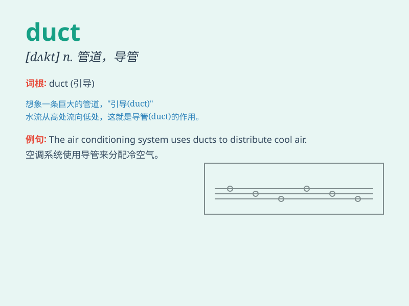

## duct

**英音:** _[dʌkt]_ **美音:** _[dʌkt]_

**译义:** *n.管,输送管,排泄管vt.通过管道输送*

### 短语

+ **air duct:** _风道；通风管_

+ **ventilation duct:** _通风管道_

+ **duct system:** _管道系统_

+ **duct tape:** _强力胶布；管道胶带_

+ **sewer duct:** _污水管道_

### 例句

#### 例句1

> **The air duct was clogged with dust.**

**中文翻译:** 通风管道被灰尘堵塞了。

**单词释义:** 管道；导管

#### 例句2

> **He studied the duct system of the building.**

**中文翻译:** 他研究了这座建筑的管道系统。

**单词释义:** 管道系统

#### 例句3

> **The tear duct was inflamed.**

**中文翻译:** 泪管发炎了。

**单词释义:** 导管；管

### 背诵小故事

> A mouse was running in a duct. It was dark and narrow. But the mouse
was brave and kept going. Finally, it found a way out. Remember,
\'duct\' means a pipe or passage for carrying something.

**一只老鼠在管道里跑。里面又黑又窄。但老鼠很勇敢，一直前进。最后，它找到了出路。记住，\'duct\'意思是输送某物的管道或通道。**

### 图义

