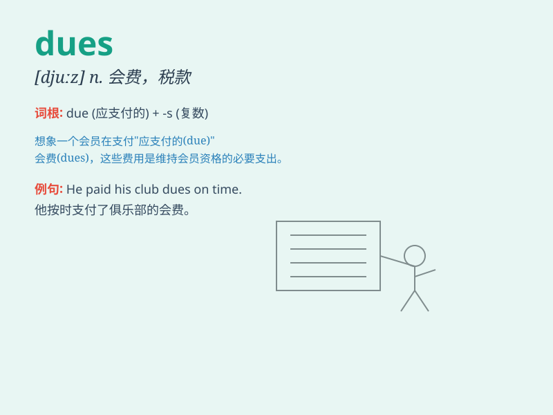

## dues

**英音:** _[djuːz]_ **美音:** _[duːz]_

**译义:** *n.会费；税款；应付款项（due的复数形式）*

### 短语

+ **pay dues:** _缴纳会费；支付应付款项_

+ **membership dues:** _会员费_

+ **annual dues:** _年度会费_

+ **union dues:** _工会会费_

+ **association dues:** _协会会费_

### 例句

#### 例句1

> **Membership dues must be paid annually.**

**中文翻译:** 会员费必须每年支付。

**单词释义:** 费用；应付款

#### 例句2

> **The company has not yet collected all the dues from its
clients.**

**中文翻译:** 公司还没有从客户那里收齐所有应付款。

**单词释义:** 应付款项

#### 例句3

> **He was reminded to pay his dues before the deadline.**

**中文翻译:** 他被提醒在截止日期前支付他的应付款。

**单词释义:** 应缴纳的费用

### 背诵小故事

> One day, Tom forgot to pay his dues for the club membership. As a
result, he couldn\'t attend the special event. Later, he realized the
importance of paying dues on time.

**一天，汤姆忘记支付俱乐部会员费了。结果，他不能参加特别活动。后来，他意识到按时交费用的重要性。**

### 图义

