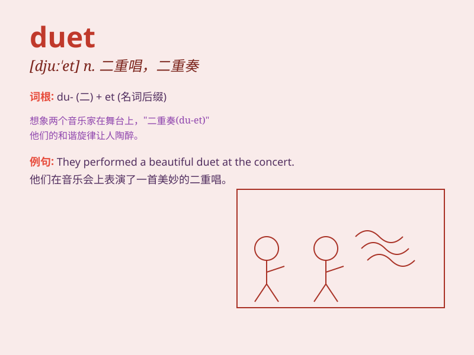

## duet

**英音:** _[djuː\'et]_ **美音:** _[dʊ\'ɛt]_

**译义:** *n.二重奏*

### 短语

+ **sing a duet:** _唱二重唱_

+ **duet performance:** _二重唱表演_

+ **instrumental duet:** _器乐二重奏_

+ **duet partner:** _二重唱搭档_

+ **classical duet:** _古典二重奏_

### 例句

#### 例句1

> **They sang a beautiful duet at the concert.**

**中文翻译:** 他们在音乐会上唱了一首优美的二重唱。

**单词释义:** 二重唱

#### 例句2

> **The duet between the two singers was the highlight of the
show.**

**中文翻译:** 这两位歌手的二重唱是这场演出的亮点。

**单词释义:** 二重唱

#### 例句3

> **She practiced the duet with her partner for weeks.**

**中文翻译:** 她和她的搭档练习这首二重唱好几周了。

**单词释义:** 二重唱

### 背诵小故事

> Two musicians were invited to perform at a grand party. They decided
to present a beautiful duet. When they sang together, their voices
blended perfectly, charming everyone.

**两位音乐家受邀在一个盛大的派对上表演。他们决定献上一首美妙的二重唱。当他们一起歌唱时，他们的声音完美融合，迷倒了所有人。**

### 图义

