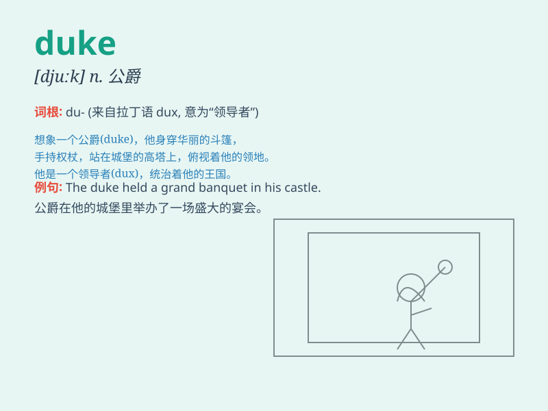

## duke

**英音:** _[djuːk]_ **美音:** _[dʊk]_

**译义:** *n.公爵(pl.)\<俚> 手,拳头*

### 短语

+ **duke it out:** _激烈争斗；大打出手_

+ **the Duke of York:** _约克公爵_

+ **duke\'s mixture:** _杜克斯合剂（一种药用混合剂）_

+ **duke\'s chair:** _公爵椅_

+ **duke\'s wife:** _公爵夫人_

### 例句

#### 例句1

> **The duke was a powerful and influential figure in the
kingdom.**

**中文翻译:** 这位公爵在王国中是一个有权势且有影响力的人物。

**单词释义:** 公爵

#### 例句2

> **The young duke inherited a vast estate from his father.**

**中文翻译:** 年轻的公爵从他父亲那里继承了一大笔遗产。

**单词释义:** 公爵

#### 例句3

> **She was presented to the duke at the grand ball.**

**中文翻译:** 在盛大的舞会上，她被介绍给了公爵。

**单词释义:** 公爵

### 背诵小故事

> The king was very ill. The duke, a brave and wise man, led the army
to protect the kingdom. He was so heroic that everyone respected him.
Remember, duke means a nobleman of high rank.

**国王病得很重。公爵，一个勇敢且睿智的人，带领军队保卫王国。他非常英勇，每个人都尊敬他。记住，duke
意思是地位很高的贵族。**

### 图义

