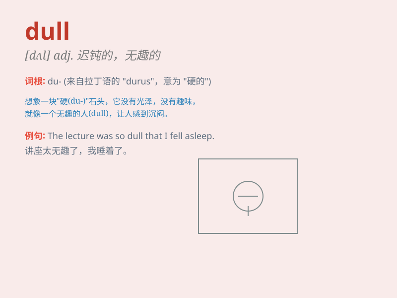

## dull

**英音:** _[dʌl]_ **美音:** _[dʌl]_

**译义:**
*adj.感觉或理解迟钝的,无趣的,呆滞的,阴暗的vt.使迟钝,使阴暗,缓和vi.变迟钝,减少*

### 短语

+ **dull pain:** _隐隐的疼痛_

+ **dull color:** _暗淡的颜色_

+ **dull job:** _枯燥的工作_

+ **dull knife:** _钝刀_

+ **dull mind:** _迟钝的头脑_

### 例句

#### 例句1

> **The knife is dull and needs sharpening.**

**中文翻译:** 这把刀钝了，需要磨锋利。

**单词释义:** 钝的

#### 例句2

> **The movie was so dull that I fell asleep.**

**中文翻译:** 这部电影太无聊了，以至于我睡着了。

**单词释义:** 无聊的；枯燥的

#### 例句3

> **The weather was dull and grey.**

**中文翻译:** 天气阴沉灰暗。

**单词释义:** 阴沉的

### 背诵小故事

> A boy named Tom always had a dull life. He did the same boring things
every day. One day, he decided to change and find excitement. After
that, his life was no longer dull.

**一个叫汤姆的男孩总是过着沉闷的生活。他每天都做着同样无聊的事情。有一天，他决定改变，去寻找刺激。从那以后，他的生活不再沉闷。**

### 图义

