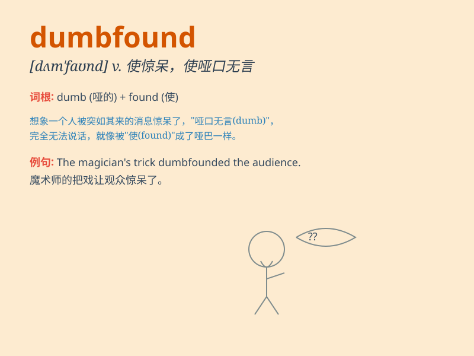

## dumbfound

**英音:** _[dʌmˈfaʊnd]_ **美音:** _[dʌmˈfaʊnd]_

**译义:** *v.使人哑然失声,使发楞*

### 短语

+ **be dumbfounded at:** _对\...\...感到惊愕_

+ **dumbfound completely:** _完全惊呆了_

+ **leave someone dumbfounded:** _使某人目瞪口呆_

+ **dumbfound with astonishment:** _惊得发呆_

+ **be momentarily dumbfounded:** _一时惊愕_

### 例句

#### 例句1

> **The unexpected news dumbfounded him.**

**中文翻译:** 这意外的消息使他惊呆了。

**单词释义:** 使惊呆

#### 例句2

> **I was completely dumbfounded by her response.**

**中文翻译:** 她的回答让我完全惊呆了。

**单词释义:** 使目瞪口呆

#### 例句3

> **The complexity of the problem dumbfounded the experts.**

**中文翻译:** 这个问题的复杂性把专家们都难住了。

**单词释义:** 使惊愕

### 背诵小故事

> A boy was showing off his magic tricks, but when he failed
spectacularly, everyone was dumbfounded. They just stared in shock, not
knowing what to say or do.

**一个男孩正在炫耀他的魔术技巧，但当他惨败时，所有人都惊呆了。他们只是震惊地盯着，不知道该说什么或做什么。**

### 图义

